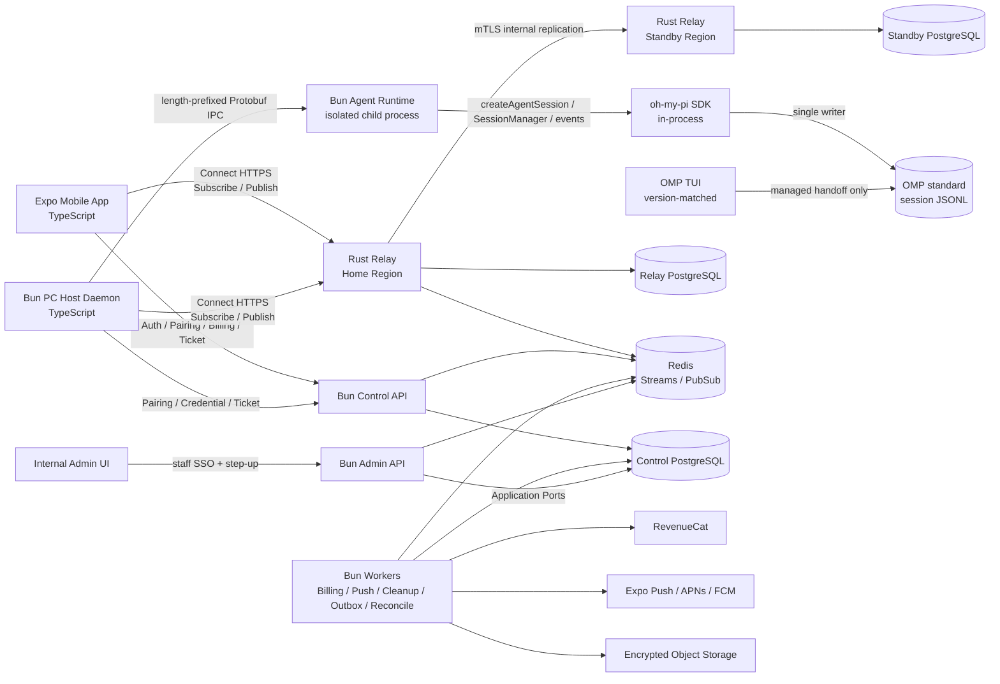
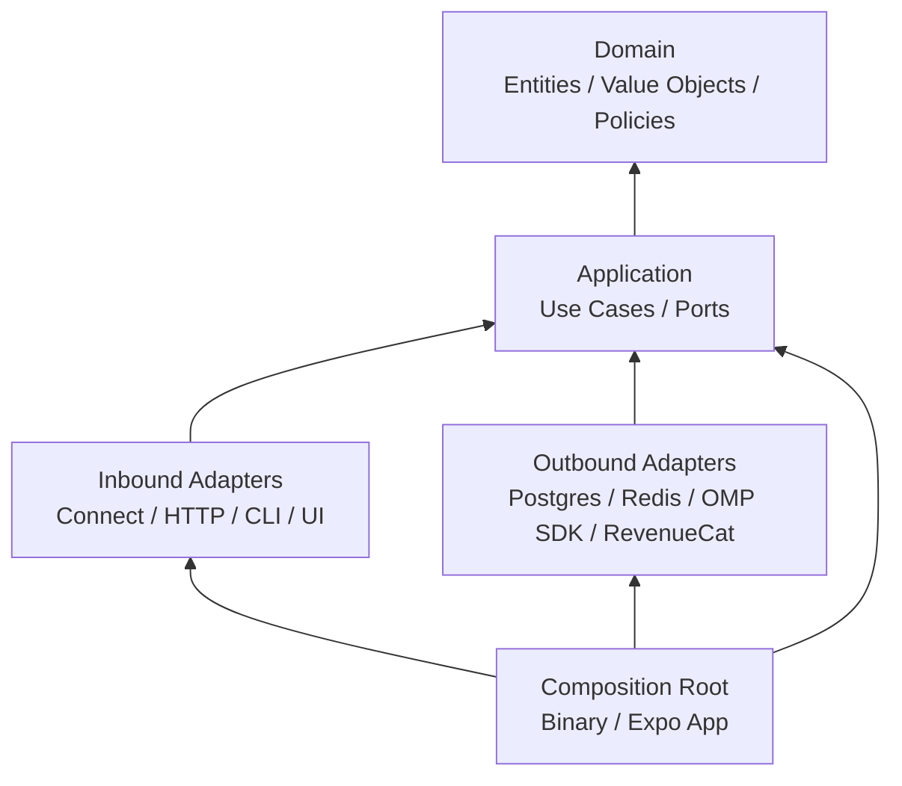
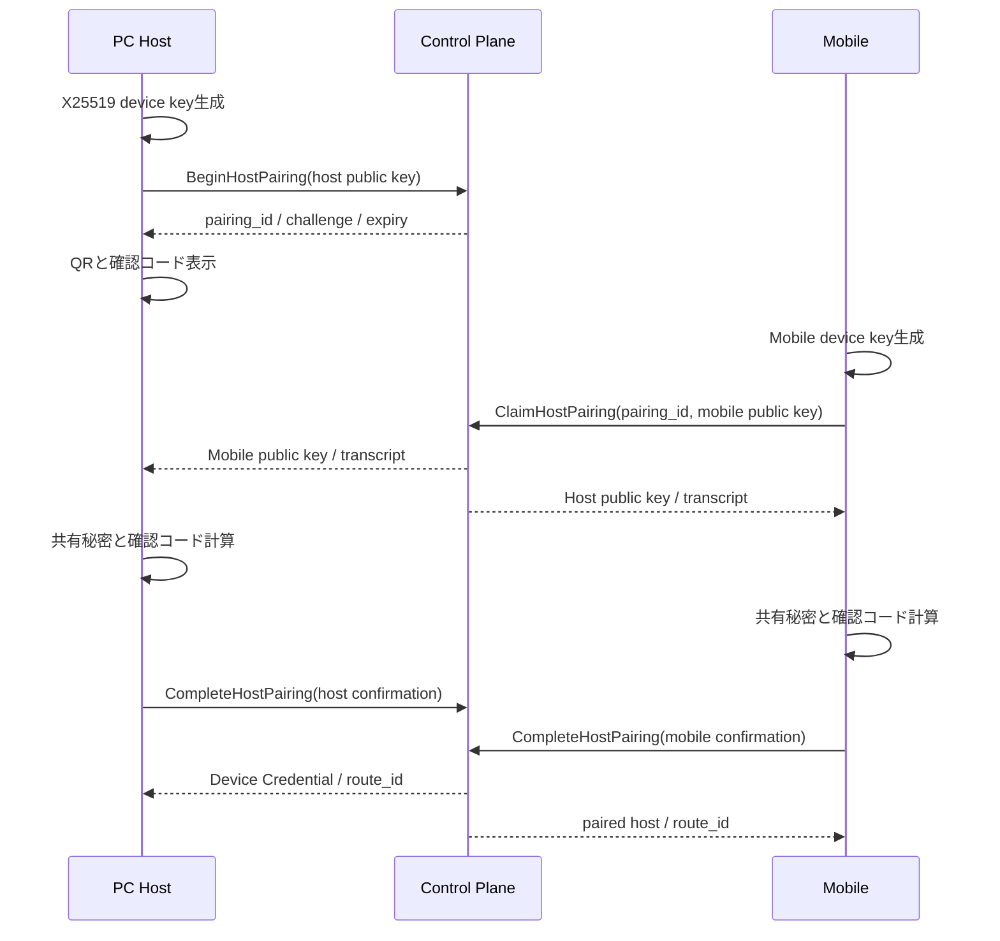
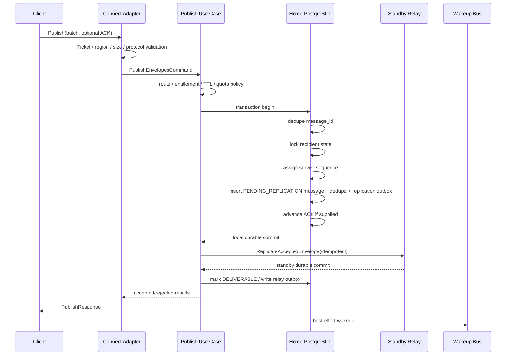
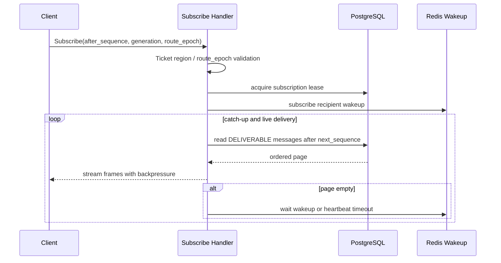
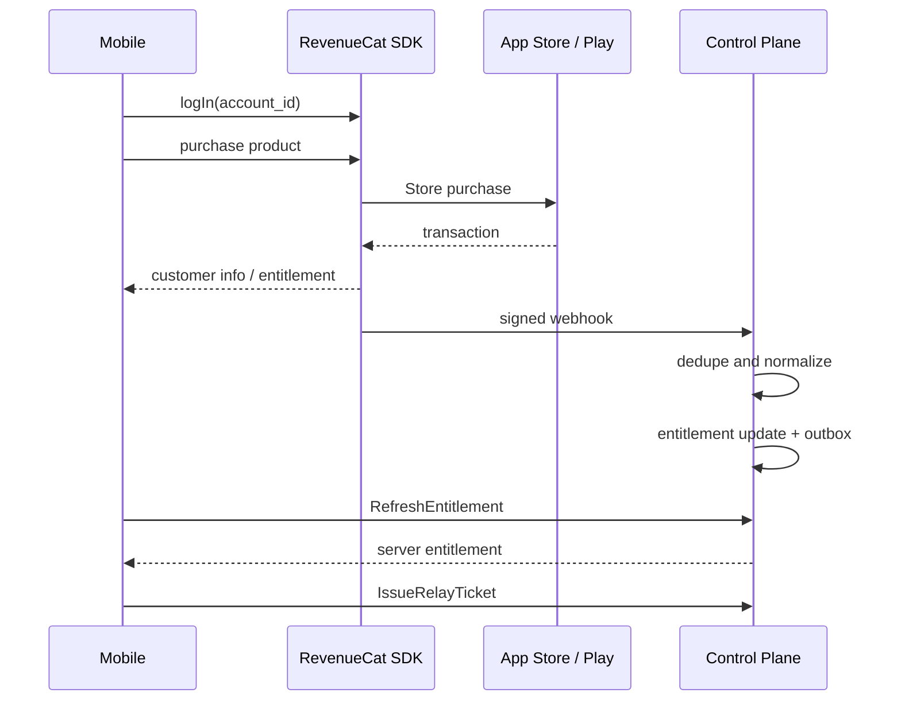
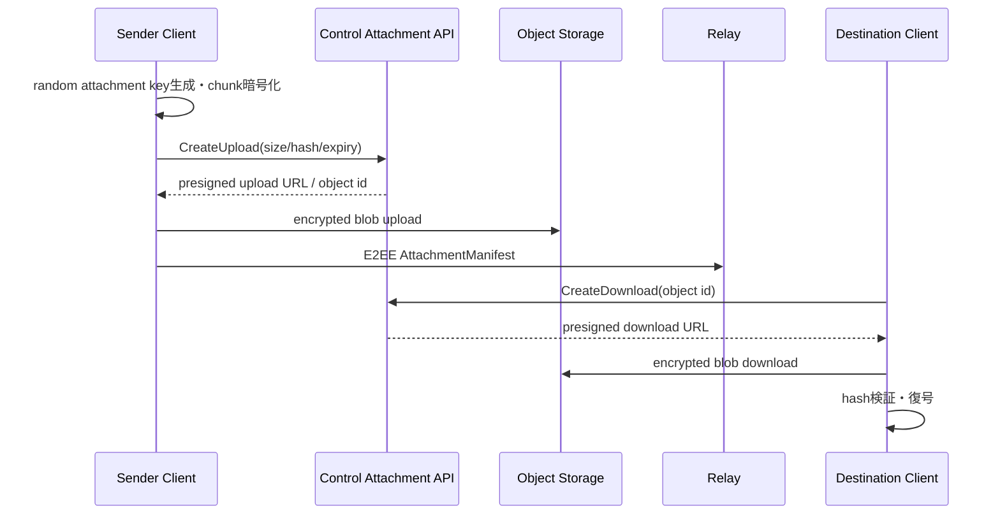

# Pocket OMP (`pocket-omp`) 技術設計書

> **Status:** Implementation-ready v1.4  
> **Date:** 2026-07-27  
> **Product:** `Pocket OMP`  
> **Repository:** `pocket-omp`  
> **Primary stack:** Rust、Bun/TypeScript、Expo、Connect RPC、OMP SDK、PostgreSQL、Redis  
> **OMP integration:** Isolated Bun Agent Runtime + `@oh-my-pi/pi-coding-agent` SDK  
> **Architecture style:** Clean Architecture + Bounded Context + Monorepo

---

## 0. エグゼクティブサマリー

本システムは、PC上で動作する oh-my-pi（以下 OMP）のセッションを、iOS/AndroidのExpoアプリから安全に操作するためのリモートクライアントである。CC Pocketのモバイル操作体験を参考にしつつ、TailscaleやPC側の受信ポートを必要とせず、PCとモバイルの双方が公式中継サービスへ**アウトバウンドHTTPS通信だけ**を行う。

本書は機能を絞った暫定版を定義しない。最初の公開版を、課金、E2EE、再送、複数端末、ファイル/Git、添付、Push、監視、管理、マルチリージョン障害対応まで備えた**完成版の本番リリース**として設計する。実装順序は依存関係を解くための内部都合にすぎず、機能を欠いた中間状態を製品版として公開しない。

```text
PC Host Daemon ── outbound HTTPS ──▶ Official Relay ◀── outbound HTTPS ── Mobile
      │                                  │
      └── local framed IPC               └── 課金・認証・暗号文配送・Push
              ▼
      Bun Agent Runtime
              │ in-process SDK API
              ▼
      @oh-my-pi/pi-coding-agent
```

最初から次の分割を採用する。

- **Rust Relay Data Plane**
  - 長時間のserver-streaming接続
  - 暗号化フレームの永続化・順序付け・再送
  - ACK、cursor、snapshot、backpressure
  - 短期Relay Ticketの検証
  - 水平スケール時のfan-out
- **Bun/TypeScript Control Plane**
  - アカウント認証
  - PC・モバイルのペアリングと端末管理
  - RevenueCat経由のサブスクリプション
  - Relay Ticket発行
  - Push通知、添付ファイル、管理機能
- **Bun/TypeScript PC Host + Agent Runtime**
  - Host DaemonとOMP SDK専用Agent Runtimeを別プロセスで実行
  - Agent Runtime内で`@oh-my-pi/pi-coding-agent` SDKを直接利用
  - SDK event・Tool UIをPocket OMPのDomain Command/Eventへ正規化
  - OMP標準のfile-backed `SessionManager`を使用し、通常のTUIと双方向にセッションを引き継ぐ
  - E2EE、ローカル権限判定、SQLite outbox、session ownership/handoffを管理
  - Connect-ES clientでRelayへ接続
- **Expo/TypeScript Mobile App**
  - Connect-ESのserver-streaming購読
  - セッション、承認、ファイル、Git、課金UI
  - SecureStoreと暗号化ローカルキャッシュ

RustとBunは**同じGitリポジトリ**に置く。ただし、コードを無理に共有せず、共有境界は次の3点に限定する。

1. `proto/`のProtobuf契約
2. `test-vectors/`の暗号・署名・相互運用テストベクター
3. ADR・脅威モデル・運用契約などの設計文書

Cargo WorkspaceとBun Workspacesをルートで併用し、各デプロイ単位・再利用境界を適切なcrate/packageへ分割する。Clean Architecture上のDomain/Application層は、Protobuf生成型、Connect、SQL、Redis、RevenueCat、Expo、OMP SDKなどの外部技術を一切参照しない。

---

## 1. 目的とスコープ

### 1.1 目的

本設計の目的は以下である。

- 自宅・オフィス・クラウドVMなどのPC上にあるOMPを、外出先のモバイルから操作できること
- PC・モバイルともに受信ポートを開けず、アウトバウンドTCP 443だけで動作すること
- 中継サーバーがプロンプト、応答、ソースコード、承認内容を復号できないこと
- 通信断、アプリのバックグラウンド化、Relay再起動、リージョン障害があっても、欠落または二重実行を起こさず復帰できること
- 公式Relayを有料サービスとして運用し、モバイルアプリ内から購入・復元・契約管理できること
- RelayをRustで実装し、大量の長時間接続、backpressure、再接続ストームへ備えること
- PC Host、Agent Runtime、Control Plane、Worker、管理系サービス、モバイルをBun/TypeScriptで統一すること
- RustとBunを一つのモノレポで一貫して開発・テスト・リリースできること
- 初回公開時点で、全受け入れ基準、SLO、セキュリティゲート、Store要件を満たすこと

### 1.2 完成版の機能範囲

本設計でいう初回公開版は、機能を絞った検証版ではなく、以下をすべて備えた本番製品である。

#### アカウント・契約

- Sign in with Apple、Google OAuth、メールアドレス + 認証コード
- App Store / Google Playの月額・年額サブスクリプション
- 購入、復元、grace period、billing retry、返金、失効、再照合
- 複数モバイル、複数PC、端末名変更、端末・経路の即時失効
- サポート担当者向けの最小権限管理UI、監査ログ、契約・配送診断

#### ペアリング・暗号・端末セキュリティ

- QRコードと双方確認コードによるHostペアリング
- PCと各Mobileのpairwise E2EE
- 鍵rotation、credential rotation、盗難端末の失効
- OS Secure Store、暗号化ローカルキャッシュ、署名付きHost更新
- Workspace単位の権限、期限付きUnattended、path traversal・symlink escape防止

#### OMPセッション操作

- セッション作成、再開、一覧、検索、アーカイブ
- OMP TUIで作成したセッションをPocket OMPで再開し、Pocket OMPで作成したセッションを通常のTUIで再開
- session single-writer、所有権lease、管理されたTUI handoff、外部同時書き込みの競合検出
- prompt、streaming response、steer、follow-up、abort、compact
- model・thinking levelの選択
- ツール、承認、質問、選択、入力、Todo、進捗、subagentの表示と応答
- Agent Runtime crash・Host再起動からの安全な復旧
- OMP SDK・セッション形式の互換性判定、未知eventの安全な表示

#### ファイル・Git・添付

- Workspace tree、ファイル閲覧、検索、差分、binary判定、サイズ制限
- Git status、diff、履歴、branch情報、安全なGit action
- 画像・ファイル添付、クライアント側暗号化、分割upload/download、hash検証
- 長大なtranscript・diffのsnapshotと増分同期

#### 配送・可用性

- Connect server-streaming + unary batch
- 順序付きat-least-once配送とapplication-level exactly-once command execution
- durable outbox/inbox、cursor、ACK、snapshot、retention gap復旧
- backpressure、slow consumer制御、rate limit、quota
- 複数Relay instance、複数AZ、ペアリージョン、リージョン切替
- Push通知、重複排除、offline queue、暗号化attachment lifecycle

#### 運用・品質

- OpenTelemetry trace/metrics/logging、SLO、alert、runbook
- DB migration、backup/restore、key rotation、security review、SBOM、署名付きartifact
- iOS/Android実機、macOS/Linux/Windows Host、Linux x64/arm64 Relay/Control
- fault injection、reconnect storm、regional failover、Store sandbox、App Review用review host

### 1.3 完成度ポリシー

- 章29の受け入れ基準を一つでも満たさないbuildは製品版候補にしない。
- E2EE、冪等性、監査、課金整合性、backpressure、障害復旧を後付け機能として扱わない。
- 実装ワークストリームは並行・順次に進めてよいが、すべてが統合された単一のRelease Gateを通過する。
- 重要経路に`TODO`、暫定的なin-memory正本、無制限buffer、検証を省略したfallbackを残さない。
- 外部依存は必ずPort/Adapter越しに隔離し、production adapterとcontract testを同時に実装する。
- 設計からの逸脱はADR、脅威評価、migration計画、ロールバック手順を伴わない限り認めない。

---

## 2. 主要な設計判断

| ID | 判断 |
|---|---|
| D-01 | Relay Data Planeは最初からRustで実装する |
| D-02 | Control Plane、PC Host、Agent Runtime、WorkerはBun/TypeScriptで実装する |
| D-03 | MobileはExpo/React Native/TypeScriptとする |
| D-04 | RustとBunは一つのモノレポに置き、Cargo WorkspaceとBun Workspacesを併用する |
| D-05 | Clean Architectureはデプロイ単位・Bounded Contextごとに適用する |
| D-06 | Protobufを唯一の言語間契約、およびHost↔Agent Runtimeのversioned process契約とし、Domain型を境界越しに共有しない |
| D-07 | Mobile/HostはConnect-ES client、Relay ServerはConnect互換の`connect-rust`を使用する |
| D-08 | 下りはserver-streaming、上りはunary batchとする |
| D-09 | 配送保証はrecipient単位の順序付きat-least-onceとする |
| D-10 | 二重実行は`message_id`と`command_id`の冪等化で防ぐ |
| D-11 | PCと各モバイルのpairwise E2EEを採用する |
| D-12 | Relayは暗号文だけを永続化し、E2EE内側の型をリンクしない |
| D-13 | 権限の最終判断は必ずPC Hostで行う |
| D-14 | Relay認証にはControl Planeが発行する短期署名済みTicketを使う |
| D-15 | Redisは低遅延通知に使い、配送の正本はPostgreSQLとする |
| D-16 | ControlとRelayはDB所有権を分け、互いのテーブルを直接参照しない |
| D-17 | Protobuf生成コードはAdapter層だけから参照する |
| D-18 | 公式Relayのdata planeは有効なサブスクリプション保有者だけが利用できる |
| D-19 | 機能を絞った暫定版を置かず、章1.2の全機能を初回公開の必須範囲とする |
| D-20 | 本番は複数AZ・ペアリージョン構成とし、Accepted messageはstandby regionへ同期耐久化する |
| D-21 | macOS、Linux、Windows HostとiOS、Android Mobileを初回公開からサポートする |
| D-22 | Workerと管理APIは権限・負荷・デプロイ責務ごとに独立Workspace/Deploymentへ分ける |
| D-23 | OMP統合はRPC modeではなく、隔離されたBun Agent Runtime内の公式SDKを主経路とする |
| D-24 | OMPセッションの正本は標準file-backed `SessionManager`とし、Pocket独自セッション形式を作らない |
| D-25 | TUIとPocket OMPの双方向引き継ぎを正式要件とし、同一セッションは常にsingle-writerとする |
| D-26 | HostとAgent Runtime間はversionedなPocket OMP内部Protobuf IPCを使用し、OMP raw event/SDK型を境界外へ出さない |
| D-27 | Pocket OMP配布物はSDKと同一OMP releaseのTUI runnerを同梱し、管理されたhandoffに使用する |
| D-28 | Host CLIとHost Daemonのローカル制御はUnix domain socket / Windows named pipeで行い、TCP listen portを作らない |
| D-29 | Bun/TypeScriptのLintはOxlintを唯一のlinterとし、type-aware lintを有効化する。Biomeはformatter専用とする |

---

## 3. システムコンテキスト



### 3.1 通信方向

すべてのクライアント接続はクライアント側から開始する。

```text
Mobile → HTTPS 443 → Control / Relay
PC Host → HTTPS 443 → Control / Relay
```

以下は存在しない。

- PC Hostの外部待受ポート
- Mobileの外部待受ポート
- NAT traversal
- UPnP
- Tailscale依存
- RelayからPCへの新規TCP接続

### 3.2 公開エンドポイント

Control Planeは一つのglobal origin、RelayはTicketで指定するregion originを使用する。

```text
https://{region}.relay.example.com/pocket.omp.relay.v1.RelayService/*
    → Rust Relay in Ticket home_region

https://api.example.com/pocket.omp.control.v1.PairingService/*
https://api.example.com/pocket.omp.control.v1.DeviceService/*
https://api.example.com/pocket.omp.control.v1.EntitlementService/*
https://api.example.com/pocket.omp.control.v1.AttachmentService/*
    → Bun Control API

https://api.example.com/webhooks/revenuecat
    → Bun Control API

https://admin.internal.example.com/pocket.omp.control.v1.AdminService/*
    → Bun Admin API（private ingress）
```

IngressまたはL7 Load BalancerでRPC path単位に振り分ける。クライアントはRust/Bunの分割を意識しない。

---

## 4. コンポーネント責務

| コンポーネント | 主責務 | 保持する秘密・平文 |
|---|---|---|
| Expo Mobile | UI、購入、E2EE、承認、stream再接続 | Mobile秘密鍵、復号済みセッション表示 |
| Bun PC Host Daemon | Relay/E2EE、権限判定、Runtime監督、session ownership、ローカルファイル/Git | PC秘密鍵、Workspace内容、製品固有状態 |
| Rust Relay | 暗号文配送、順序、cursor、ACK、backpressure | Relay Ticket検証鍵、暗号文のみ |
| Bun Control API | アカウント、ペアリング、端末、契約、Ticket発行 | 認証情報、端末公開鍵、契約情報、署名秘密鍵 |
| Bun Worker | RevenueCatイベント、Push、cleanup、outbox、reconciliation | Push token、課金イベント |
| Bun Admin | support UI/API、RBAC、監査、配送診断 | 最小化されたaccount・契約・metadata |
| Bun Agent Runtime + OMP SDK | LLMセッション、SDK event正規化、Tool UI bridge、標準SessionManager | OMP設定、Provider credential、復号済みセッション内容 |
| OMP TUI | 管理されたhandoff後のローカル対話操作 | 同じOMP標準セッション、Provider credential |

### 4.1 信頼境界

- **PC Host、Agent Runtime、Mobileは内容を復号する信頼済みendpoint**
- **Agent RuntimeはHostより狭い権限で動作し、session単位で再起動可能な隔離境界**
- **Relayは配送メタデータを扱うが本文を復号しないsemi-trusted service**
- **Control Planeはアカウント・契約・端末公開鍵を扱うがセッション本文を持たない**
- **Push providerには内容を送らない**
- **Object Storageにはクライアント側暗号化済みblobだけを置く**

---

## 5. モノレポ構成

### 5.1 推奨ディレクトリ

```text
pocket-omp/
├── Cargo.toml                    # Virtual Cargo Workspace
├── Cargo.lock
├── rust-toolchain.toml
├── package.json                  # Bun Workspace root
├── bun.lock
├── bunfig.toml
├── tsconfig.base.json
├── .oxlintrc.json               # Oxlint root config / type-aware lint
├── biome.json                   # formatter専用。Biome linterは無効
├── justfile                      # Rust/Bun/Buf横断タスク
├── mise.toml                     # Toolchain pinning
│
├── apps/
│   ├── mobile/                   # Expo composition root / UI
│   ├── host/                     # PC Host CLI/daemon composition root
│   └── admin/                    # Internal support/admin web UI
│
├── services/
│   ├── relay-server/             # Rust binary composition root
│   │   └── src/bin/
│   │       ├── relay-server.rs
│   │       └── relay-migrate.rs
│   ├── agent-runtime/            # Bun child-process composition root / OMP SDK owner
│   ├── control-api/              # Bun Connect/HTTP public API
│   ├── admin-api/                # Bun private admin API / RBAC / audit
│   ├── control-worker-billing/   # RevenueCat ingest/reconciliation
│   ├── control-worker-push/      # Push dispatch
│   ├── control-worker-cleanup/   # TTL/quota cleanup
│   ├── control-worker-outbox/    # Durable event dispatch
│   ├── control-worker-reconcile/ # Periodic consistency reconciliation
│   └── review-host/              # App Review用deterministic OMP host
│
├── crates/
│   ├── relay-domain/
│   ├── relay-application/
│   ├── relay-protocol/           # Rust generated Protobuf/Connect types
│   ├── relay-adapters/           # PostgreSQL/Redis/Ticket/replication adapters
│   ├── relay-transport-connect/  # Connect handlers and DTO mapping
│   ├── relay-telemetry/          # Tower/OTel integration
│   └── relay-testkit/
│
├── packages/
│   ├── proto/                    # TS generated Protobuf descriptors/types
│   ├── crypto/                   # Pairwise E2EE implementation
│   ├── relay-client/             # Connect-ES stream/reconnect/outbox logic
│   ├── control-core/             # Control Domain/Application/Ports
│   ├── control-adapters/         # DB/Auth/RevenueCat/Push/Ticket adapters
│   ├── agent-domain/             # SDK非依存のAgent/Session Domain型
│   ├── host-core/                # Host Domain/Application/Ports
│   ├── host-adapters/            # SQLite/Keychain/FS/Git/Control adapters
│   ├── agent-runtime-core/       # Runtime Application/Ports
│   ├── agent-runtime-protocol/   # versioned local IPC codec/DTO mapper
│   ├── agent-runtime-client/     # Host側process supervisor / IPC adapter
│   ├── host-local-protocol/      # CLI↔Daemon UDS/named-pipe protocol
│   ├── omp-sdk-adapter/          # OMP SDK integration / UI context / event mapper
│   ├── mobile-core/              # Mobile use cases/state projections
│   ├── config/                   # Runtime config schema and validation
│   ├── telemetry/                # TS OTel/logging policy
│   └── testkit/
│
├── proto/
│   └── pocket/
│       └── omp/
│           ├── relay/v1/
│           ├── control/v1/
│           ├── session/v1/
│           ├── runtime/v1/       # Host↔Agent Runtime local IPC
│           ├── hostlocal/v1/     # Host CLI↔Daemon local control
│           └── internal/v1/
│
├── db/
│   ├── relay/                    # Rust/SQLx-owned migrations
│   └── control/                  # Bun-owned migrations
│
├── test-vectors/
│   ├── e2ee/
│   ├── pairing/
│   ├── relay-ticket/
│   ├── protobuf/
│   ├── runtime-ipc/              # Host↔Agent Runtime framing/compatibility
│   └── omp-session-interop/      # SDK↔TUI round-trip/migration fixtures
│
├── docs/
│   ├── architecture/
│   ├── adr/
│   ├── protocol/
│   ├── runbooks/
│   └── threat-model.md
│
├── infra/
│   ├── terraform/
│   ├── kubernetes/
│   └── docker/
│
└── .github/workflows/
```

### 5.2 分割の原則

Workspaceは「ファイルを整理するため」ではなく、次のいずれかを満たす境界に対して作る。

- 独立したデプロイ単位
- 独立してテストすべきClean Architecture境界
- 重い外部依存をCoreから隔離するAdapter
- 複数アプリが再利用する安定したライブラリ
- 変更頻度や責任者が明確に異なる部分

以下のような過分割は避ける。

```text
NG: use-case一つにつきcrate/package一つ
NG: Entity一つにつきcrate/package一つ
NG: 単にディレクトリを跨ぐためだけのworkspace
```

### 5.3 Cargo Workspace

ルートはpackageを持たないvirtual workspaceとする。

```toml
# Cargo.toml
[workspace]
members = [
  "crates/*",
  "services/relay-server",
]
default-members = ["services/relay-server"]
resolver = "3"

[workspace.package]
edition = "2024"
rust-version = "1.97"
version = "1.0.0"
license = "MIT"

[workspace.dependencies]
anyhow = "1"
async-trait = "0.1"
bytes = "1"
connectrpc = "=0.8.1"
serde = { version = "1", features = ["derive"] }
sqlx = { version = "0.8", default-features = false, features = [
  "runtime-tokio-rustls", "postgres", "migrate", "uuid", "time"
] }
tokio = { version = "1", features = ["macros", "rt-multi-thread", "signal"] }
tower = "0.5"
tracing = "0.1"
uuid = { version = "1", features = ["v7", "serde"] }

[workspace.lints.rust]
unsafe_code = "forbid"
missing_debug_implementations = "warn"

[workspace.lints.clippy]
all = "warn"
pedantic = "warn"
unwrap_used = "deny"
expect_used = "deny"
```

`connect-rust`はpre-1.0であるため、正確な採用バージョンはlockし、`relay-transport-connect`と`relay-protocol`以外へ型を漏らさない。更新時はconformance testとE2Eを必須にする。

Cargo Workspaceにより、全crateがルートの`Cargo.lock`、`target/`、共通metadata、依存バージョン、lint設定を共有する。

### 5.4 Bun Workspaces

```jsonc
// package.json
{
  "name": "pocket-omp",
  "private": true,
  "packageManager": "bun@1.3.14",
  "workspaces": [
    "apps/*",
    "packages/*",
    "services/agent-runtime",
    "services/control-*",
    "services/admin-api",
    "services/review-host"
  ],
  "scripts": {
    "gen": "buf generate",
    "format": "biome format --write .",
    "format:check": "biome format .",
    "lint": "oxlint .",
    "lint:fix": "oxlint --fix .",
    "lint:all": "just lint",
    "typecheck": "bun --filter '*' run typecheck",
    "test:ts": "bun --filter '*' run test",
    "test:rust": "cargo test --workspace",
    "check": "just check"
  },
  "catalog": {
    "@biomejs/biome": "<exact-pinned-version>",
    "@connectrpc/connect": "<pinned>",
    "@connectrpc/connect-web": "<pinned>",
    "@bufbuild/protobuf": "<pinned>",
    "@oh-my-pi/pi-coding-agent": "<exact-pinned-version>",
    "oxlint": "<exact-pinned-version>",
    "oxlint-tsgolint": "<exact-pinned-version>",
    "typescript": "<exact-pinned-7.x-version>"
  },
  "devDependencies": {
    "@biomejs/biome": "catalog:",
    "oxlint": "catalog:",
    "oxlint-tsgolint": "catalog:",
    "typescript": "catalog:"
  }
}
```

各workspace間の依存は`workspace:*`を使う。

```jsonc
{
  "name": "@pocket-omp/omp-sdk-adapter",
  "private": true,
  "dependencies": {
    "@pocket-omp/agent-domain": "workspace:*",
    "@pocket-omp/agent-runtime-core": "workspace:*",
    "@oh-my-pi/pi-coding-agent": "catalog:"
  }
}
```

`bunfig.toml`ではisolated installを明示し、phantom dependencyを防ぐ。

```toml
[install]
linker = "isolated"
```

#### 5.4.1 Bun/TypeScriptのLint方針

Bun Workspace全体のlinterは**Oxlintだけ**を使用する。ESLintおよびBiome linterは併用しない。ルートから一度だけOxlintを実行し、workspaceを跨ぐimport graphと型情報を同一実行で解析する。

```jsonc
// .oxlintrc.json
{
  "$schema": "./node_modules/oxlint/configuration_schema.json",
  "options": {
    "typeAware": true,
    "maxWarnings": 0
  },
  "plugins": [
    "eslint",
    "oxc",
    "typescript",
    "unicorn",
    "import",
    "promise"
  ],
  "categories": {
    "correctness": "error",
    "suspicious": "error",
    "perf": "warn",
    "pedantic": "off",
    "style": "off",
    "restriction": "off",
    "nursery": "off"
  },
  "rules": {
    "typescript/no-floating-promises": "error",
    "typescript/no-misused-promises": "error",
    "import/no-cycle": "error"
  },
  "ignorePatterns": [
    "**/node_modules/**",
    "**/dist/**",
    "**/build/**",
    "**/.expo/**",
    "packages/proto/src/gen/**"
  ],
  "overrides": [
    {
      "files": ["apps/mobile/**/*.{ts,tsx}"],
      "plugins": [
        "eslint",
        "oxc",
        "typescript",
        "unicorn",
        "import",
        "promise",
        "react"
      ]
    },
    {
      "files": ["apps/admin/**/*.{ts,tsx}"],
      "plugins": [
        "eslint",
        "oxc",
        "typescript",
        "unicorn",
        "import",
        "promise",
        "react",
        "jsx-a11y"
      ]
    }
  ]
}
```

運用ルール:

- `oxlint`と`oxlint-tsgolint`はルートの`devDependencies`へ完全固定する。
- type-aware lintを常時有効にし、Promise未処理など型情報が必要な欠陥もRelease Gateで拒否する。
- Oxlintの`typeCheck`は使用せず、型検査の正本は各Workspaceの`tsc --noEmit`とする。Lintと型検査を別ジョブに保ち、診断責務を明確にする。
- warningも失敗扱いにするため`maxWarnings: 0`を設定する。例外は設定変更ではなく、理由付きの最小範囲`oxlint-disable`とレビューを必要とする。
- `oxlint --fix`は安全な自動修正だけに使う。suggestionやdangerous fixをCIまたはcommit hookで自動適用しない。
- root configを原則とし、nested configは生成コードや実行環境の差が不可避な場合だけ追加する。
- OMP SDK、Expo、Bun、React Native固有の不足ルールが見つかった場合も、まずOxlintのnative rule/pluginを採用する。JS pluginは安定性と性能を個別評価し、ADRなしでは導入しない。
- `biome.json`ではlinterを無効にし、Biomeはformatだけを担当する。

```jsonc
// biome.json（要点）
{
  "linter": {
    "enabled": false
  },
  "formatter": {
    "enabled": true
  }
}
```

Oxlintのtype-aware解析が必要とするため、依存Workspaceの型宣言を先に生成する。CIでは`buf generate`と必要なWorkspace buildを済ませた後に`bun run lint`を実行する。Oxlint更新はtype-aware ruleの診断変化を含み得るため、Renovateでは`oxlint`と`oxlint-tsgolint`を同一PRにまとめ、全TypeScript test・architecture rule・縦断E2Eを通す。

### 5.5 Toolchain固定

作成時点の安定版を固定し、Renovate等で更新PRを作る。

```toml
# mise.toml
[tools]
rust = "1.97.1"
bun = "1.3.14"
buf = "<pinned>"
just = "<pinned>"
```

RustとBunの更新は同時に行う必要はない。各更新PRは該当Workspaceのテストと縦断E2Eを通す。

### 5.6 横断タスク

CargoとBunを無理に一つのビルドシステムへ統合せず、`just`を薄いオーケストレーターとして使う。

```make
# justfile（概略）
set shell := ["bash", "-euo", "pipefail", "-c"]

gen:
    buf generate

format:
    cargo fmt --all
    bun run format

format-check:
    cargo fmt --all -- --check
    bun run format:check

lint:
    cargo clippy --workspace --all-targets --all-features -- -D warnings
    bun run lint
    buf lint

check-generated:
    buf generate
    git diff --exit-code -- crates/relay-protocol packages/proto

test:
    cargo nextest run --workspace
    bun run test:ts

check: format-check lint check-generated test
```

---

## 6. Clean Architecture

### 6.1 適用単位

Clean Architectureをリポジトリ全体へ一枚岩で適用せず、以下のBounded Contextごとに適用する。

1. Relay Data Plane
2. Control Plane
3. PC Host / Agent Runtime
4. Mobile App

Context間はProtobuf、署名済みTicket、イベント、暗号化payloadを通じて接続する。別ContextのDomain Entityを直接importしない。

### 6.2 依存方向



守るべき原則は次である。

- DomainはApplication、Adapter、Frameworkを知らない
- ApplicationはDomainと自身が定義したPortだけを知る
- AdapterはApplicationのPortを実装する
- Inbound Adapterはwire DTOをApplication Commandへ変換する
- Composition Rootだけが具象実装を組み立てる
- 生成されたProtobuf型はDomain/Applicationへ入れない
- DB row型、SDK型、HTTP Request型、OMP SDK型をCoreへ入れない

### 6.3 Rust crate依存グラフ

```text
relay-domain
    ▲
    │
relay-application
    ▲                 relay-protocol
    │                       ▲
    ├── relay-adapters      │
    └── relay-transport-connect
                ▲          ▲
                └────┬─────┘
                 relay-server
```

詳細:

| crate | 内容 | 主な禁止依存 |
|---|---|---|
| `relay-domain` | ID、Entity、Policy、Domain Error | Tokio、SQLx、Redis、Connect、JWT、Protobuf |
| `relay-application` | Use Case、Port、Transaction境界 | SQLx、Redis、Axum、Connect、生成型 |
| `relay-protocol` | Buf生成型、Connect service descriptor | Domain/Application |
| `relay-adapters` | PostgreSQL、Redis、Ticket検証、Clock | Connect transport |
| `relay-transport-connect` | RPC handler、interceptor、DTO mapper | SQLx、Redisの直接利用 |
| `relay-telemetry` | tracing、OTel、Tower layer | Domainルール |
| `relay-testkit` | In-memory Port、fixture、fault injection | 本番Composition Root |
| `relay-server` | 設定読込、DI、起動、shutdown | ビジネスルール実装 |

`relay-domain`と`relay-application`の`Cargo.toml`に外部Adapter依存を宣言しないことで、crate graph自体をアーキテクチャ境界として利用する。

### 6.4 TypeScript package依存グラフ

```text
@pocket-omp/control-core                 @pocket-omp/agent-domain
          ▲                                  ▲           ▲
          │                                  │           │
 control-adapters                    host-core     agent-runtime-core
          ▲                              ▲              ▲
 control-api/admin/workers      host-adapters +   omp-sdk-adapter
                                runtime-client          ▲
                                      ▲          agent-runtime service
                                  host app

@pocket-omp/mobile-core → Expo adapters → mobile app
proto / crypto / relay-client / runtime-protocol / host-local-protocol = 外側の共有基盤
```

ルール:

- `*-core`と`agent-domain`は`@connectrpc/*`、Expo、RevenueCat、DB、OMP SDK、生成Protobuf型をimportしない
- `@oh-my-pi/pi-coding-agent`をimportできるのは`packages/omp-sdk-adapter`と`services/agent-runtime`だけとする
- `packages/proto`はgenerated codeだけを公開する
- `packages/crypto`は暗号primitiveの薄いラッパーとtest vectorだけを持つ
- `packages/relay-client`はConnect-ES transportと再接続機構を提供する
- `packages/agent-runtime-protocol`はHost↔Runtime IPC framingとwire DTO mappingだけを担い、Domain ruleを持たない
- `packages/host-local-protocol`はCLI↔DaemonのUDS/named-pipe framingとpeer認証だけを担う
- `apps/mobile`、`apps/host`、`apps/admin`、`services/agent-runtime`、`services/control-*`、`services/admin-api`、`services/review-host`だけがComposition Rootになる
- packageの`exports`以外へのdeep importは禁止する

`dependency-cruiser`または同等のimport ruleで、次をCI上で拒否する。

```text
control-core       -> control-adapters          禁止
host-core          -> host-adapters             禁止
host-core          -> omp-sdk-adapter           禁止
agent-runtime-core -> omp-sdk-adapter           禁止
agent-domain       -> agent-runtime-protocol    禁止
mobile-core        -> expo-*                    禁止
*-core             -> packages/proto            原則禁止
*-core             -> @connectrpc/*             禁止
packages/*         -> @oh-my-pi/pi-coding-agent `omp-sdk-adapter`以外禁止
```

Coreで共有すべき意味がある場合は、wire型を共有するのではなく、そのContext内に独自のDomain型を定義してAdapterでmapする。

---

## 7. Protobufとコード生成

### 7.1 Package構成

```text
pocket.omp.relay.v1
    Relay Data Planeの外側APIと暗号化Envelope

pocket.omp.control.v1
    Pairing、Device、Entitlement、Relay Ticket、Attachment

pocket.omp.session.v1
    E2EE内側のSession Command/Event/Snapshot

pocket.omp.runtime.v1
    Host Daemon↔Agent RuntimeのローカルIPC。Rust RelayとMobileには公開しない

pocket.omp.hostlocal.v1
    `pocket-omp` CLI↔Host Daemonのローカル制御。Unix domain socket / Windows named pipe専用

pocket.omp.internal.v1
    Control→Relayの失効通知、Relay→Push Workerのwake event
```

Rust Relayは`pocket.omp.session.v1`、`pocket.omp.runtime.v1`、`pocket.omp.hostlocal.v1`をdecodeしない。Rust生成対象から3 packageを除外し、Relay binaryへdescriptorをリンクしない構成とする。

### 7.2 Buf設定

```yaml
# buf.yaml
version: v2
modules:
  - path: proto
lint:
  use:
    - STANDARD
breaking:
  use:
    - FILE
```

生成先:

```text
TypeScript: packages/proto/src/gen/
Rust:       crates/relay-protocol/src/generated/
```

`buf.gen.yaml`の概略:

```yaml
version: v2
plugins:
  - remote: buf.build/bufbuild/es:<PINNED_VERSION>
    out: packages/proto/src/gen
    opt:
      - target=ts

  - local: protoc-gen-buffa
    out: crates/relay-protocol/src/generated/buffa
    opt:
      - views=true
      - json=true

  - local: protoc-gen-buffa-packaging
    out: crates/relay-protocol/src/generated/buffa
    strategy: all

  - local: protoc-gen-connect-rust
    out: crates/relay-protocol/src/generated/connect
    opt:
      - buffa_module=crate::proto

  - local: protoc-gen-buffa-packaging
    out: crates/relay-protocol/src/generated/connect
    strategy: all
    opt:
      - filter=services
```

pluginはCIでversionとchecksumを固定する。生成物はリポジトリへcommitし、CIで再生成後のdiffがないことを検証する。

### 7.3 互換性ポリシー

- package majorを`v1`に固定する
- field削除・番号再利用・型変更は禁止
- enumの未知値を許容する
- 新機能はadditive fieldとcapability negotiationで追加する
- `buf breaking`をmain branchに対して実行する
- 破壊的変更が必要なら`v2`を並行提供する
- Mobile、Host、Relayの最低対応versionを明示する

---

## 8. Connect RPC設計

### 8.1 Connect-ESとRust Serverの関係

ユーザー要件であるConnect-ESのStream機能は、MobileとPC Hostのclientで利用する。ServerはRustのためConnect-ESそのものではなく、Connect wire protocol互換の`connect-rust`を利用する。

```text
Expo / Bun Host
  @connectrpc/connect + @connectrpc/connect-web
            │
            │ Connect protocol over HTTPS
            ▼
Rust Relay
  connect-rust + Axum/Tower
```

これにより、クライアントAPIはConnect-ESの`AsyncIterable`としてserver-streamingを扱い、RelayはRustで同じprotocolを提供できる。

### 8.2 なぜbidi-streaming一本にしないか

v1では次を採用する。

```text
下り: Subscribe() server-streaming
上り: Publish() unary batch
```

理由:

- Mobileのbackground移行時にrequest body streamを維持できる前提を置かない
- HTTP proxy、CDN、Load Balancerとの互換性を高くする
- 上りを短い冪等requestにすることでretryを簡単にする
- ACKと再送cursorを明示化できる
- HTTP/2必須にせず、Connect over HTTP/1.1でも成立する

Relayの信頼性契約はPublish/Subscribe方式に固定する。transport最適化を行っても、ACK、cursor、再送、冪等性の意味論は変更しない。

### 8.3 Relay Service

```proto
service RelayService {
  rpc Subscribe(SubscribeRequest) returns (stream RelayFrame);
  rpc Publish(PublishRequest) returns (PublishResponse);
  rpc Ack(AckRequest) returns (AckResponse);
  rpc PutSnapshot(PutSnapshotRequest) returns (PutSnapshotResponse);
  rpc GetSnapshot(GetSnapshotRequest) returns (GetSnapshotResponse);
}
```

Standby同期にはpublic data planeと分離した内部Connect serviceを使う。

```proto
service RelayReplicationService {
  rpc ReplicateBatch(ReplicateBatchRequest)
      returns (ReplicateBatchResponse);
  rpc GetReplicationWatermark(GetReplicationWatermarkRequest)
      returns (GetReplicationWatermarkResponse);
}
```

このserviceはprivate network、mTLS、workload identity、region allow-listを必須とし、Mobile/Host用Ticketを受理しない。

### 8.4 Control Services

```proto
service PairingService {
  rpc BeginHostPairing(BeginHostPairingRequest)
      returns (BeginHostPairingResponse);
  rpc WatchHostPairing(WatchHostPairingRequest)
      returns (stream HostPairingEvent);
  rpc ClaimHostPairing(ClaimHostPairingRequest)
      returns (ClaimHostPairingResponse);
  rpc CompleteHostPairing(CompleteHostPairingRequest)
      returns (CompleteHostPairingResponse);
}

service DeviceService {
  rpc ListHosts(ListHostsRequest) returns (ListHostsResponse);
  rpc ListDevices(ListDevicesRequest) returns (ListDevicesResponse);
  rpc RenameHost(RenameHostRequest) returns (RenameHostResponse);
  rpc RevokeDevice(RevokeDeviceRequest) returns (RevokeDeviceResponse);
}

service EntitlementService {
  rpc GetEntitlement(GetEntitlementRequest)
      returns (GetEntitlementResponse);
  rpc RefreshEntitlement(RefreshEntitlementRequest)
      returns (RefreshEntitlementResponse);
  rpc IssueRelayTicket(IssueRelayTicketRequest)
      returns (IssueRelayTicketResponse);
}

service PushService {
  rpc RegisterPushToken(RegisterPushTokenRequest)
      returns (RegisterPushTokenResponse);
}

service AttachmentService {
  rpc CreateUpload(CreateUploadRequest) returns (CreateUploadResponse);
  rpc CreateDownload(CreateDownloadRequest) returns (CreateDownloadResponse);
}

service AdminService {
  rpc GetAccountDiagnostics(GetAccountDiagnosticsRequest)
      returns (GetAccountDiagnosticsResponse);
  rpc ForceEntitlementReconciliation(ForceEntitlementReconciliationRequest)
      returns (ForceEntitlementReconciliationResponse);
  rpc RevokeDeviceAsSupport(RevokeDeviceAsSupportRequest)
      returns (RevokeDeviceAsSupportResponse);
  rpc GetDeliveryMetadata(GetDeliveryMetadataRequest)
      returns (GetDeliveryMetadataResponse);
}
```

### 8.5 Subscribeのwire model

```proto
message SubscribeRequest {
  string recipient_device_id = 1;
  uint64 after_server_sequence = 2;
  string connection_generation = 3;
  uint32 protocol_version = 4;
  uint64 route_epoch = 5;
}

message RelayFrame {
  oneof body {
    DeliveredEnvelope envelope = 1;
    Heartbeat heartbeat = 2;
    Reauthenticate reauthenticate = 3;
    ResetRequired reset_required = 4;
    StreamSuperseded stream_superseded = 5;
    RegionRedirect region_redirect = 6;
  }
}

message DeliveredEnvelope {
  uint64 server_sequence = 1;
  SealedEnvelope envelope = 2;
}
```

`connection_generation`はclientが接続ごとに生成するUUIDである。同一deviceの新しいstreamが開いたら旧streamを`STREAM_SUPERSEDED`として終了する。

### 8.6 Publishのwire model

```proto
message PublishRequest {
  repeated OutboundEnvelope envelopes = 1;
  optional uint64 ack_server_sequence = 2;
}

message PublishResponse {
  repeated PublishResult results = 1;
  uint64 accepted_ack_server_sequence = 2;
}

message PublishResult {
  string message_id = 1;
  oneof outcome {
    Accepted accepted = 2;
    Rejected rejected = 3;
  }
}
```

Protocol上の規定上限:

- 1 requestあたり最大64 envelope
- 1 envelopeあたり最大256 KiB
- request全体は最大2 MiB
- TTLは5分以上7日以下
- serverが認識しないpriorityはnormal扱い

値は構成可能にするが、Protocol上の絶対上限も設ける。

### 8.7 暗号化Envelope

```proto
message OutboundEnvelope {
  string message_id = 1;
  string route_id = 2;
  string sender_device_id = 3;
  string recipient_device_id = 4;
  uint64 client_sequence = 5;
  int64 created_at_ms = 6;
  int64 expires_at_ms = 7;
  string key_id = 8;
  bytes nonce = 9;
  bytes ciphertext = 10;
  Priority priority = 11;
  NotificationHint notification_hint = 12;
}
```

Relayは認証済みprincipalの`device_id`と`sender_device_id`が一致することを検証する。recipientとのroute grantも確認する。

E2EEのAssociated Dataには、少なくとも次をcanonical serializationで含める。

```text
protocol version
message_id
route_id
sender_device_id
recipient_device_id
client_sequence
created_at_ms
expires_at_ms
key_id
priority
notification_hint
```

`server_sequence`は暗号化後にRelayが割り当てるためE2EEのAssociated Dataには含めない。これは配送cursorであり、受信側はE2EE内側の`event_id`、`command_id`、`client_sequence`でも重複・不整合を検出する。

### 8.8 E2EE内側のpayload

```proto
message SecurePayload {
  uint32 protocol_version = 1;
  string capability_set = 2;

  oneof body {
    DeviceHello device_hello = 10;
    HostSnapshot host_snapshot = 11;
    SessionSnapshot session_snapshot = 12;
    SessionEvent session_event = 13;
    ClientCommand command = 14;
    CommandAccepted command_accepted = 15;
    CommandResult command_result = 16;
    ApprovalRequest approval_request = 17;
    ApprovalResponse approval_response = 18;
    UiRequest ui_request = 19;
    UiResponse ui_response = 20;
    AttachmentManifest attachment_manifest = 21;
    SecureError error = 22;
  }
}
```

Relayはこのmessageをserialize済みbytesとしてしか扱わない。

### 8.9 エラーモデル

Connect標準codeにmachine-readable detailを付ける。

| Connect code | detail code例 |
|---|---|
| `UNAUTHENTICATED` | `TICKET_EXPIRED`, `TICKET_INVALID` |
| `PERMISSION_DENIED` | `ENTITLEMENT_REQUIRED`, `DEVICE_REVOKED`, `ROUTE_NOT_GRANTED` |
| `INVALID_ARGUMENT` | `FRAME_TOO_LARGE`, `BATCH_TOO_LARGE`, `INVALID_EXPIRY` |
| `RESOURCE_EXHAUSTED` | `RATE_LIMITED`, `QUEUE_QUOTA_EXCEEDED`, `SLOW_CONSUMER` |
| `FAILED_PRECONDITION` | `SNAPSHOT_REQUIRED`, `PAIRING_NOT_READY`, `PROTOCOL_UNSUPPORTED` |
| `ALREADY_EXISTS` | `IDEMPOTENCY_CONFLICT` |
| `ABORTED` | `STREAM_SUPERSEDED`, `CONCURRENT_CURSOR_UPDATE` |
| `UNAVAILABLE` | `TRANSIENT_STORAGE_FAILURE`, `RETRY_LATER` |

エラー本文にprompt、file path、ciphertext、token、ユーザー入力を含めない。

---

## 9. 認証・端末・Relay Ticket

### 9.1 アカウント認証

Mobileのアカウント認証はControl Planeが担当する。

- Sign in with Apple
- Google OAuth
- メールアドレス + 認証コード

認証provider固有のclaimはControl Adapterで正規化し、Coreには`AccountId`と認証済みidentityだけを渡す。

PC Hostはブラウザログインを必須にせず、QRペアリングによってアカウント配下へ登録される。

### 9.2 Device Credential

ペアリング完了後、Control PlaneはHostへ回転可能な長期Device Credentialを発行する。

- token本体はHostのOS Credential Storeへ保存
- Control DBにはhashだけを保存
- refresh時にrotationする
- reuse検知時はcredential family全体を失効する
- Mobile側のrefresh credentialもSecureStoreへ保存する

長期credentialをRelayへ直接送らない。

### 9.3 Relay Ticket

Mobile/HostはControl Planeの`IssueRelayTicket`を呼び、短期署名済みTicketを取得する。

規定claim:

```jsonc
{
  "iss": "https://api.example.com",
  "aud": "pocket-omp-relay",
  "sub": "account-id",
  "device_id": "device-id",
  "device_kind": "HOST | MOBILE",
  "route_grants": ["opaque-route-id"],
  "entitlement": "relay_pro",
  "credential_generation": 4,
  "home_region": "jp-east-1",
  "relay_origin": "https://jp-east-1.relay.example.com",
  "route_epoch": 7,
  "iat": 1785072000,
  "exp": 1785072600,
  "jti": "ticket-id"
}
```

方針:

- Ed25519署名
- `alg`を固定し、headerから自由選択させない
- 有効期限は原則10分以下
- `kid`で鍵rotation
- Rust Relayはcached JWKSでローカル検証
- Relay requestごとにControl Planeへ同期問い合わせしない
- streamはTicket expiry前に`Reauthenticate`を送り、期限で終了する

### 9.4 即時失効

短期Ticketだけでは最大10分の失効遅延があるため、Control Planeは次のイベントをdurable busへ出す。

```text
DeviceRevoked
CredentialGenerationAdvanced
EntitlementChanged
RouteRevoked
AccountSuspended
```

Rust Relayはイベントを購読し、該当deviceのcacheとactive streamを即時無効化する。イベントを一時的に受け取れない場合でもTicket TTLが上限となる。

---

## 10. ペアリングとE2EE

### 10.1 ペアリングフロー



QRに含めるもの:

```text
protocol version
pairing_id
短期challenge
Host公開鍵
有効期限
公式service identifier
```

QRに含めないもの:

- 長期Bearer Token
- Account session
- Provider API key
- E2EE秘密鍵
- 復号鍵そのもの

Pairing Requestは5分程度で失効し、1回だけClaim可能とする。HostとMobileに表示される短い確認コードをユーザーが比較することで、初回鍵交換時の中間者攻撃を検出する。

### 10.2 暗号方式

v1の規定:

```text
端末鍵交換    X25519
鍵導出        HKDF-SHA-256
AEAD          XChaCha20-Poly1305
Device署名    Ed25519（鍵更新・端末証明・update manifest検証）
乱数          OS CSPRNG
```

TypeScript側では監査実績のある実装を薄くwrapし、暗号primitiveを自作しない。

### 10.3 Pairwise key

PCと各Mobileは個別の鍵を持つ。

```text
Host A
├── pairwise key with iPhone
├── pairwise key with iPad
└── pairwise key with Android
```

同一イベントを複数Mobileへ送る場合、Hostがrecipientごとに個別暗号化する。契約上の端末数quotaを設け、暗号化コストより端末単位失効と鍵分離の単純さを優先する。

### 10.4 鍵保存

| 場所 | 保存方法 |
|---|---|
| iOS/Android | Expo SecureStore / OS-backed storage |
| macOS | Keychain |
| Windows | Credential Manager / DPAPI-backed storage |
| Linux | Secret Service。headlessはsystemd credentials、最終fallbackはArgon2id暗号化vault |
| Relay | 公開鍵、`key_id`、暗号文のみ |
| Control | Device公開鍵、credential hash、pairing transcript |

秘密鍵をSQLite、AsyncStorage、通常の設定JSON、ログへ保存しない。

### 10.5 Relayが観測できるmetadata

Relayは以下を知る。

- account/device/routeのopaque ID
- 送受信時刻
- ciphertext size
- sequenceとTTL
- coarseなnotification hint
- IP addressと接続情報

Relayは以下を知らない。

- promptとresponse
- source codeとfile path
- command内容
- approval内容
- model/provider
- OMP session本文

`notification_hint`は利便性とmetadata privacyのトレードオフである。v1の規定は次の粗い分類だけにする。

```proto
enum NotificationHint {
  NOTIFICATION_HINT_UNSPECIFIED = 0;
  NOTIFICATION_HINT_NONE = 1;
  NOTIFICATION_HINT_WAKE = 2;
  NOTIFICATION_HINT_ATTENTION_REQUIRED = 3;
  NOTIFICATION_HINT_RUN_FINISHED = 4;
}
```

---

## 11. Rust Relay Data Plane: Clean Architecture

### 11.1 Domain Model

`relay-domain`に置く主なValue Object:

```text
AccountId
DeviceId
RouteId
MessageId
SnapshotId
TicketId
ServerSequence
ClientSequence
ConnectionGeneration
RegionId
RouteEpoch
ReplicationStatus
CiphertextSize
RetentionDeadline
```

主なEntity/Aggregate:

```text
RelayPrincipal
RouteGrant
SealedEnvelope
RecipientCursor
SubscriptionLease
RegionRoute
ReplicationRecord
EncryptedSnapshot
DeliveryQuota
```

主なDomain Policy:

```text
RoutingPolicy
EntitlementPolicy
EnvelopeLimitPolicy
RetentionPolicy
SubscriptionPolicy
RegionalRoutingPolicy
DurabilityPolicy
QuotaPolicy
```

Domainは暗号文を`Bytes`相当のopaque valueとして扱い、ProtobufやAEADの意味を知らない。

### 11.2 Application Use Cases

`relay-application`:

```text
OpenSubscription
PublishEnvelopes
AcknowledgeDelivery
PutEncryptedSnapshot
GetEncryptedSnapshot
HandleSecurityInvalidation
ReplicateAcceptedEnvelope
RepairReplication
PromoteRouteEpoch
SweepExpiredMessages
DispatchRelayOutbox
```

Use Caseは入力をApplication Commandへ変換済みの状態で受け取る。

```rust
pub struct PublishEnvelopesCommand {
    pub principal: RelayPrincipal,
    pub envelopes: Vec<EnvelopeDraft>,
    pub piggyback_ack: Option<ServerSequence>,
}
```

### 11.3 Outbound Ports

PortはApplication側が所有する。

```rust
pub trait MessageRepository: Send + Sync {
    async fn append_batch(
        &self,
        batch: AppendBatch,
    ) -> Result<AppendBatchResult, RepositoryError>;

    async fn read_after(
        &self,
        recipient: DeviceId,
        after: ServerSequence,
        limit: ReadLimit,
    ) -> Result<MessagePage, RepositoryError>;
}

pub trait CursorRepository: Send + Sync {
    async fn acknowledge(
        &self,
        recipient: DeviceId,
        sequence: ServerSequence,
    ) -> Result<AckResult, RepositoryError>;
}

pub trait WakeupBus: Send + Sync {
    async fn notify_recipient(&self, recipient: DeviceId)
        -> Result<(), BusError>;

    async fn subscribe(&self, recipient: DeviceId)
        -> Result<WakeupSubscription, BusError>;
}
```

```rust
pub trait StandbyReplicationPort: Send + Sync {
    async fn replicate_batch(
        &self,
        target: RegionId,
        batch: ReplicationBatch,
    ) -> Result<ReplicationReceipt, ReplicationError>;
}
```

そのほか:

```text
SnapshotRepository
SubscriptionLeaseRepository
TicketVerifier
InvalidationSubscription
RelayOutboxRepository
RegionRouteRepository
StandbyReplicationPort
RateLimiter
Clock
IdGenerator
TransactionRunner
```

### 11.4 Inbound Adapter

`relay-transport-connect`が担当する。

- Connect interceptorでTicket取得
- `TicketVerifier`を通してApplicationの`RelayPrincipal`へ変換
- generated requestをApplication Commandへmap
- Use Caseを実行
- Application ErrorをConnect code/detailへmap
- server streamへ`RelayFrame`をencode
- private `RelayReplicationService`をmTLS/workload identityで認証し、replication Application Commandへmap
- request size、deadline、compression、CORS等のtransport policy

HandlerはSQLx、Redis client、JWT libraryを直接呼ばない。

### 11.5 Outbound Adapter

`relay-adapters`のmodule:

```text
postgres/
    PostgresMessageRepository
    PostgresCursorRepository
    PostgresSnapshotRepository
    PostgresSubscriptionLeaseRepository
    PostgresRelayOutboxRepository

redis/
    RedisWakeupBus
    RedisInvalidationSubscription
    RedisRateLimiter

replication/
    ConnectStandbyReplicationClient
    PostgresReplicationInboxRepository
    ReplicationRepairRepository

auth/
    Ed25519RelayTicketVerifier
    CachedJwksProvider

system/
    SystemClock
    UuidV7IdGenerator
```

### 11.6 Composition Root

`services/relay-server`だけが具象実装を組み立てる。

```rust
#[tokio::main]
async fn main() -> anyhow::Result<()> {
    let config = Config::load()?;
    let telemetry = Telemetry::init(&config.telemetry)?;

    let postgres = PostgresPool::connect(&config.database).await?;
    let redis = RedisClient::connect(&config.redis).await?;

    let repositories = PostgresRepositories::new(postgres);
    let wakeups = RedisWakeupBus::new(redis.clone());
    let verifier = Ed25519RelayTicketVerifier::new(config.jwks);
    let replication = ConnectStandbyReplicationClient::new(
        config.standby,
        config.workload_identity,
    );

    let application = RelayApplication::new(
        repositories,
        wakeups,
        replication,
        verifier,
        SystemClock,
    );

    RelayServer::new(application, telemetry)
        .serve_with_graceful_shutdown(config.listen)
        .await
}
```

上記は概念例であり、具象型がApplication層へ逆流しないことが要点である。

---

## 12. Relayの配送アルゴリズム

### 12.1 保証

配送契約:

- recipient device単位の単調増加`server_sequence`
- 保持期間内の順序付きat-least-once network delivery
- `Publish`の`Accepted`応答前にhome regionとstandby regionへdurable persistence
- 同一`sender_device_id + message_id`の重複排除
- Hostの`command_id`永続化によるapplication-level exactly-once command execution
- cumulative ACK
- reconnect cursorからの再送
- region failover時のroute epoch更新とcursor継続、必要時のsnapshot reset

保証境界:

- 全recipientを跨ぐglobal orderingは定義しない
- network delivery自体はexactly-onceではなく、重複を前提にendpointで冪等化する
- TTL経過後はsnapshotを正本として復旧する
- 悪意あるRelayによる遅延・破棄は暗号だけでは防げないため、cursor gap、timeout、delivery healthとして検出・表示する

### 12.2 Publishフロー



重要な意味:

- `Accepted`はhome regionとstandby regionの双方でdurableになり、home側messageが`DELIVERABLE`へ遷移した後だけ返す
- standbyへの同期耐久化が完了しない場合は`UNAVAILABLE`を返し、home側の`PENDING_REPLICATION` recordをrepair workerが再送する
- 同じrequestをretryしても同じ`message_id`は再挿入しない
- 同じ`message_id`かつ同じcanonical metadata/ciphertext hashなら元の状態またはAccepted結果を返す
- 同じ`message_id`で内容が異なる場合は`IDEMPOTENCY_CONFLICT`として拒否する
- 複数recipientへのbatchはrecipient単位で結果を返す
- live wakeupに失敗してもmessageはDBに残り、subscriberのpoll/次のwakeupで取得できる
- Redis publishをDB transactionの正しさへ含めず、transactional outboxで補完する
- home region障害時はstandbyを昇格し、`route_epoch`を増加させて新Ticketを発行する

### 12.3 Subscribeフロー

Redisからframe本文を直接受け取ってstreamへ流す設計は採用しない。Redisは「新しいデータがある」というwake-up signalに限定し、本文の正本は常にPostgreSQLとする。



この方式の利点:

- Redis message lossが本文lossにならない
- Relay instanceが異なってもDBから同じ順序で読める
- replayとlive fan-outのraceを単純化できる
- `PENDING_REPLICATION` messageをclientへ露出しない
- slow consumer時に無制限のframe channelを作らない
- Redis障害時も短いpollingへdegradeできる

### 12.4 Backpressure

各streamに次の制限を置く。

```text
DB fetch page: 最大128件または1 MiB
送信中buffer: 最大2 MiB
heartbeat: 25秒前後
write deadline: frame種別ごとに設定
stream lifetime: Ticket有効期限以内
```

送信が進まない場合:

1. pageの追加fetchを止める
2. write deadlineまで待つ
3. `SLOW_CONSUMER`としてstreamを切断する
4. clientは最後にACK済みのcursorから再接続する

メモリ上へ未送信frameを無制限に積まない。

### 12.5 ACK

ACKはcumulativeとする。

```text
ack(100) = 1..100を復号・永続化・適用済み
```

ルール:

- ACK値は後退させない
- 未発行sequenceを超えるACKは拒否
- `PublishRequest`へpiggyback可能
- trafficがない場合は`Ack` RPCを使う
- ACK済みmessageは短いgrace period後に削除可能

MobileはUIへ描画しただけでなく、ローカルprojectionへtransactionalに反映した後にACKする。Hostはcommandをdurable inboxへ記録した後にACKする。

### 12.6 Client側冪等性

Relayの`message_id` dedupeだけではAgent commandの二重実行を防げない。Host側で`command_id`を保存する。

```text
processed_command
├── command_id PK
├── session_id
├── received_at
├── status
├── accepted_response_ciphertext
└── final_result_ciphertext
```

同じ`command_id`を受信した場合:

- Agent Runtimeへ再送しない
- 保存済み`CommandAccepted`または`CommandResult`を再配送する

Mobileは`event_id`と`revision`で重複deltaを排除する。

### 12.7 Snapshotとretention gap

Relayのイベント保持期間より古いcursorで接続した場合、`ResetRequired`を返す。

```text
ResetRequired
├── reason = RETENTION_GAP
├── latest_snapshot_id
└── earliest_available_sequence
```

Clientは次の順で復旧する。

1. `GetSnapshot`
2. snapshot暗号文を復号
3. 内側の`base_event_id`とstate hashを検証
4. snapshotの外側cursor以降を`Subscribe`
5. deltaを適用

Relayが持つsnapshotもE2EE暗号文である。規定値:

```text
message retention      7日
snapshot retention     最新4世代かつ30日
processed command ID   30日
pairing request         5分
attachment              7日または明示expiry
```

値は契約planと運用設定へ切り出すが、短縮時にもprocessed command保持期間がmessage retentionを下回らないことを検証する。

### 12.8 Delta batching

OMP SDKのtext delta eventを1件ずつRelayへ送らない。Hostで次のいずれかに達したらflushする。

```text
50〜100ms経過
4〜16 KiB蓄積
tool/approval/error/agent_end到着
```

`abort`、承認応答、UI応答は高priorityで即時送信する。

Session Snapshotは次のいずれかで生成する。

```text
500 event到達
暗号化前projection差分が5 MiB到達
active sessionで15分経過
agent_end / compact / archive
```

snapshot生成とevent cursor確定はHost SQLite transactionで一貫させる。

---

## 13. Relay永続化

### 13.1 DB所有権

本番ではRelayとControlを別Managed PostgreSQL clusterへ分離し、regionごとにも独立したfailure domainを持たせる。local developmentだけは同一PostgreSQL server上の別databaseを許可する。

```text
relay database   owner: Rust Relay DB role
control database owner: Bun Control DB role
```

相互databaseへの権限を付与しない。cross-context join、foreign key、直接read/writeは禁止する。Context間連携はTicket、内部Connect service、durable event busで行う。

### 13.2 Relay tables

#### `relay.recipient_state`

```text
recipient_device_id   PK
home_region           text not null
standby_region        text not null
route_epoch           bigint not null
next_sequence         bigint not null
acked_sequence        bigint not null
lease_generation      text nullable
lease_expires_at      timestamptz nullable
updated_at            timestamptz not null
```

#### `relay.message`

```text
expires_at             PK part 1  # range partition key
recipient_device_id   PK part 2
server_sequence       PK part 3
sender_device_id      not null
message_id            not null
route_id              not null
client_sequence       not null
created_at            not null
key_id                 not null
nonce                  bytea not null
ciphertext             bytea not null
ciphertext_size        integer not null
priority               smallint not null
notification_hint      smallint not null
delivery_state         smallint not null  # PENDING_REPLICATION | DELIVERABLE
home_region           text not null
route_epoch            bigint not null
```

Message本体とは別に、partitionを跨ぐ冪等性を保証する小さなtableを持つ。

#### `relay.message_dedup`

```text
sender_device_id      PK part 1
message_id            PK part 2
payload_hash          not null
recipient_device_id   not null
server_sequence       not null
expires_at            not null
replication_status    not null
```

主要index:

```text
(recipient_device_id, delivery_state, server_sequence)
(expires_at)
(route_id, created_at)
```

#### `relay.snapshot`

```text
recipient_device_id
snapshot_id
route_id
created_at
expires_at
covers_through_sequence  # transport hint
key_id
nonce
ciphertext
ciphertext_size
```

#### `relay.replication_outbox`

```text
id
home_region
standby_region
recipient_device_id
server_sequence
payload_hash
created_at
attempt_count
replicated_at
```

#### `relay.replication_inbox`

```text
source_region
replication_batch_id
recipient_device_id
replicated_next_sequence
received_at
payload_hash
PRIMARY KEY (source_region, replication_batch_id)
```

#### `relay.outbox`

```text
id
aggregate_key
kind
payload
created_at
available_at
attempt_count
published_at
```

Relay Outboxはwake-up、Push wake request、監査イベント等に使う。payloadへciphertext本文を重複保存しない。

### 13.3 Partitioning

`relay.message`は本番投入時から`expires_at`の日次range partitionとする。各partitionには次のindexを作る。

```text
(recipient_device_id, delivery_state, server_sequence)
(route_id, created_at)
(expires_at)
```

運用要件:

- partition managerが7日先まで作成する
- partition作成失敗はalertし、未作成partitionへ書き込む前にreadinessを落とす
- TTL経過後はrow単位DELETEではなくpartition detach/dropを基本とする
- `relay.message_dedup`は小さな独立tableとして保持し、partitionを跨ぐ`sender_device_id + message_id`の一意性を保証する
- `relay.replication_inbox`でstandby側のbatch再送を冪等化し、同じsequenceを重複insertしない
- recipient偏りが実測閾値を超えた場合に備え、schemaはhash subpartitionを追加可能な形にするが、導入にはonline migrationを用いる

### 13.4 Redisの役割

Redisは次だけに利用する。

- recipient wake-up Pub/Sub
- Control→Relayのdurable invalidation stream
- distributed rate limit
- short-lived connection presence

Redisを次の正本にはしない。

- encrypted message
- delivery cursor
- entitlement
- device ownership
- pairing state

Redis停止時:

- Publishはhome/standby PostgreSQLへの耐久化が可能な限り成功する。Redis障害だけでは失敗させない
- Subscribeは短周期pollingへfallback
- invalidationはTicket TTLまで遅れる可能性がある
- outbox dispatcherが復旧後に再送する

---

## 14. Subscription Leaseと水平スケール

### 14.1 一つのdeviceに一つのactive stream

同一deviceで複数streamが開いたときは、最新の`connection_generation`を勝者とする。

Subscription Leaseの正本はPostgreSQL rowのgeneration + expiryとし、Redisはsupersede通知だけに使う。

```text
Open stream A generation=G1
Open stream B generation=G2
→ DB leaseをG2へ更新
→ G1 handlerはheartbeat時または通知時に失効を検出
→ StreamSupersededを返して終了
```

即時性向上のためRedisでsupersede signalも送る。

### 14.2 Relay instance間のrouting

```text
Mobile stream → Relay A
Host Publish  → Relay B
```

HostのPublishはRelay BでDB commitされ、recipient wake-upがRedisへ送られる。Relay Aはwake-upを受け、DBからordered pageを読む。Sticky sessionは不要である。

### 14.3 Graceful shutdown

Relay deployment時:

1. readinessをfalseにする
2. 新規Subscribeを受け付けない
3. active streamへ`Reauthenticate/ServerDraining`相当を送る
4. 最大20〜30秒drainする
5. unary requestのDB transaction完了を待つ
6. streamを終了する

clientはjitter付きで別instanceへ再接続する。shutdown時にmemory上だけのdelivery stateを正本にしない。

---

## 15. Bun Control Plane: Clean Architecture

### 15.1 `control-core`

`packages/control-core`はDomain、Application、Portだけを含むpure TypeScript packageとする。

主なDomain Model:

```text
Account
AuthIdentity
Device
Host
RoutePair
PairingRequest
DeviceCredential
Entitlement
SubscriptionEvent
PushRegistration
AttachmentGrant
RegionRoute
AdminRole
AdminAuditEvent
SupportAccessGrant
```

主なUse Case:

```text
AuthenticateAccount
BeginHostPairing
ClaimHostPairing
CompleteHostPairing
ListHostsAndDevices
RenameHost
RevokeDevice
RotateDeviceCredential
IssueRelayTicket
GetEntitlement
RefreshEntitlement
ProcessRevenueCatWebhook
ReconcileEntitlement
RegisterPushToken
CreateAttachmentUpload
CreateAttachmentDownload
DispatchPushNotification
AssignHomeRegion
PromoteStandbyRegion
GetAccountDiagnostics
ForceEntitlementReconciliation
RecordAdminAuditEvent
```

主なPort:

```ts
export interface AccountRepository { /* ... */ }
export interface DeviceRepository { /* ... */ }
export interface PairingRepository { /* ... */ }
export interface EntitlementRepository { /* ... */ }
export interface AuthIdentityVerifier { /* ... */ }
export interface PurchaseProvider { /* ... */ }
export interface RelayTicketSigner { /* ... */ }
export interface PushGateway { /* ... */ }
export interface ObjectStorageGateway { /* ... */ }
export interface ControlOutbox { /* ... */ }
export interface RegionDirectory { /* ... */ }
export interface AdminAuditRepository { /* ... */ }
export interface RelayDiagnosticsReader { /* ... */ }
export interface Clock { /* ... */ }
```

`control-core`は以下をimportしない。

```text
@connectrpc/*
RevenueCat SDK
Expo SDK
PostgreSQL driver / ORM
jose
APNs / FCM SDK
AWS/GCP SDK
```

### 15.2 `control-adapters`

```text
src/
├── postgres/
│   ├── account-repository.ts
│   ├── device-repository.ts
│   ├── pairing-repository.ts
│   ├── entitlement-repository.ts
│   ├── region-route-repository.ts
│   ├── admin-audit-repository.ts
│   └── control-outbox.ts
├── auth/
│   ├── apple-verifier.ts
│   ├── google-verifier.ts
│   ├── email-code-provider.ts
│   └── staff-sso-verifier.ts
├── billing/
│   └── revenuecat-adapter.ts
├── ticket/
│   └── ed25519-ticket-signer.ts
├── push/
│   └── expo-push-adapter.ts
├── storage/
│   └── object-storage-adapter.ts
├── event-bus/
│   └── redis-stream-adapter.ts
├── region/
│   └── region-directory-adapter.ts
└── admin/
    └── relay-diagnostics-adapter.ts
```

Adapter固有の型をCoreへ返さず、必ずDomain/Application DTOへ変換する。

### 15.3 Control API

`services/control-api`はComposition RootとInbound Adapterを持つ。

```text
Connect routes
REST webhook routes
Auth interceptor
Request/response mapping
Dependency wiring
Health/readiness
```

RevenueCat webhookはConnectではなく通常のHTTPS endpointで受ける。署名検証前にbodyをparse・加工しない。

`services/admin-api`は同じApplication Portを利用する別Composition Rootとし、private ingress、staff SSO、RBAC、step-up authentication、immutable audit eventを必須とする。Admin APIは暗号文本文、復号鍵、Provider credential、完全なfile pathを取得できない。

### 15.4 Control Worker

Workerは権限、負荷特性、障害範囲、release cadenceが異なるため、最初から独立Bun Workspace・独立Deploymentとする。

```text
services/control-worker-billing   RevenueCat webhook event処理・再照合
services/control-worker-push      Push生成・送信・receipt確認
services/control-worker-cleanup   pairing/message metadata/attachment TTL cleanup
services/control-worker-outbox    durable event bus dispatch
services/control-worker-reconcile Store・DB・Relay stateの定期整合性検査
```

各Workerは専用Service Account、専用DB権限、専用queue consumer groupを持つ。同一container imageのcommand切替は採用せず、SBOMと権限境界をDeployment単位で固定する。

### 15.5 Control tables

```text
control.account
control.auth_identity
control.device
control.host
control.route_pair
control.pairing_request
control.device_credential
control.entitlement
control.billing_event
control.push_token
control.attachment
control.outbox
control.signing_key_metadata
control.region_route
control.admin_role
control.support_access_grant
control.admin_audit_event
```

重要な制約:

```text
billing_event.provider_event_id UNIQUE
pairing_request.challenge UNIQUE
route_pair(host_device_id, mobile_device_id) UNIQUE
push_token(provider, token) UNIQUE
```

Push tokenなど再取得に平文が必要なtokenはKMS-backed envelope encryptionで保存し、認証credentialとone-time codeはsalt付きhashだけを保存する。

---

## 16. サブスクリプション設計

### 16.1 Product Model

製品の課金モデルは単一entitlementとする。

```text
Entitlement: relay_pro
Products:
  relay_pro_monthly
  relay_pro_yearly
```

有料対象:

- Relay Subscribe / Publish
- 暗号化offline queue
- Push通知
- 複数PC・複数Mobile
- 暗号化attachment
- OMP SDK/TUI互換更新・session migration rehearsal

モデル利用料はユーザー自身のProvider契約・API key側で発生し、Relay料金には含めない。

### 16.2 RevenueCat integration



Mobile SDKの状態は購入直後のUXに利用するが、Relay許可の正本はControl Planeのnormalized entitlementとする。

### 16.3 Entitlement state

```ts
type EntitlementState =
  | { kind: "active"; usableUntil: Date }
  | { kind: "grace_period"; usableUntil: Date }
  | { kind: "billing_retry"; usableUntil: Date | null }
  | { kind: "paused" }
  | { kind: "expired" }
  | { kind: "refunded" }
  | { kind: "revoked" };
```

Relay Ticketを発行できるのは`usableUntil > now`の状態だけとする。billing retryを利用可能とするかはStore/RevenueCatのgrace設定に従い、単純な文字列判定ではなく`usableUntil`へ正規化する。

### 16.4 無料範囲

無料planは用意しないが、購入に必要なcontrol plane操作は未購入でも許可する。

許可:

- アカウント作成・ログイン
- plan表示
- 購入・購入復元
- entitlement照会
- QR読み取りとpairing requestの作成
- 接続診断

拒否:

- Relay Ticket発行
- Hostのdata plane接続
- Mobileのdata plane接続
- offline queue
- Push delivery
- attachment upload

未購入状態では`BeginHostPairing`、QR scan、双方確認コード表示まで許可する。`CompleteHostPairing`による長期Device Credential・routeの確定とRelay Ticket発行は、有効なentitlement取得後にだけ許可する。Pairing TTL内に購入が完了しない場合は同じQRから再開せず、新しいchallengeを発行する。

### 16.5 Webhook処理

- provider event IDで冪等化
- 署名検証
- event発生時刻と受信順序を比較
- 古いeventで新しい状態を巻き戻さない
- entitlement更新とControl Outboxを同一transactionでcommit
- 返金・失効時は`EntitlementChanged`をRelayへ送る
- 定期reconciliationでWebhook欠落を補う

### 16.6 Expo build

IAPはnative moduleを必要とするため、Expo Goでは実購入を検証しない。Development BuildとStore sandbox accountをCI/QAの標準経路にする。

---

## 17. PC HostとOMP SDK Agent Runtime: Clean Architecture

### 17.1 責務分離

PC側を、一つの長寿命Host Daemonと、再起動可能なAgent Runtime子プロセスへ分ける。

```text
Pocket OMP Host Daemon
├── Relay接続・E2EE・durable outbox/inbox
├── Device/Workspace/Permission管理
├── session ownership・TUI handoff
├── Agent Runtime supervisor
└── SQLite・OS Secure Store
        │
        │ pocket.omp.runtime.v1 / length-prefixed Protobuf
        ▼
Pocket OMP Agent Runtime（active sessionごとのBun子プロセス）
├── @oh-my-pi/pi-coding-agent SDK
├── createAgentSession / SessionManager
├── AuthStorage / ModelRegistry / Settings / Discovery
├── RemoteExtensionUIContext
├── OMP event normalizer
└── Tool/Approval policy bridge
```

Host DaemonはOMP SDK、Extension、MCP、LSP、Provider clientをロードしない。Agent Runtimeの未捕捉例外、native dependency障害、Extension障害、MCP/LSP process障害が発生しても、Relay接続、暗号鍵、outbox、session ownershipはHost Daemon側で維持する。

### 17.2 Workspaceと依存方向

```text
agent-domain
    ▲                       ▲
    │                       │
host-core          agent-runtime-core
    ▲                       ▲
    │                       │
host-adapters       omp-sdk-adapter
agent-runtime-client        ▲
    ▲                 agent-runtime service
    │
host app

agent-runtime-protocol = Host/Runtime双方の外側Adapter
```

各Workspaceの責務:

| Workspace | 責務 | 禁止事項 |
|---|---|---|
| `agent-domain` | Agent Session、Run、Tool、Approval、UI requestのSDK非依存Domain型 | OMP SDK、Protobuf、process API |
| `host-core` | Host Use Case、Permission、ownership、Runtime/Relay Port | SDK型、SQLite、Connect、child process |
| `host-adapters` | SQLite、Keychain、FS、Git、Control gateway | OMP SDK import |
| `agent-runtime-core` | Runtime Command処理、Session lifecycle、Domain event生成、Port | OMP SDK、stdio framing |
| `agent-runtime-protocol` | Protobuf codec、length-prefix framing、wire↔Domain mapper | Domain policy、SDK import |
| `agent-runtime-client` | Host側spawn、health、IPC request correlation、restart | SDK import、Session file直接更新 |
| `host-local-protocol` | CLI↔Daemon framing、ACL/peer確認、handoff command mapping | Relay接続、Session file直接更新 |
| `omp-sdk-adapter` | SDK session、SessionManager、UI context、event mapping | Relay、SQLite、Mobile wire型 |
| `services/agent-runtime` | Runtime Composition Root | Domain ruleの直書き |

`@oh-my-pi/pi-coding-agent`の型は`omp-sdk-adapter`のpublic APIからも露出させない。SDKのbreaking changeはこのAdapterとcompatibility suiteへ閉じ込める。

### 17.3 Host Application Port

```ts
export interface AgentRuntimeSupervisor {
  listSessions(input: ListOmpSessionsInput): Promise<ReadonlyArray<OmpSessionSummary>>;
  start(input: StartRuntimeInput): Promise<AgentRuntimeHandle>;
  send(runtimeId: RuntimeId, command: AgentCommand): Promise<CommandAcceptance>;
  events(runtimeId: RuntimeId): AsyncIterable<AgentDomainEvent>;
  prepareHandoff(input: PrepareSessionHandoffInput): Promise<HandoffTicket>;
  stop(runtimeId: RuntimeId, reason: RuntimeStopReason): Promise<void>;
}

export interface RelayGateway { /* Subscribe / Publish / Ack / Snapshot */ }
export interface ControlGateway { /* Pairing / Ticket / Device */ }
export interface LocalHostStore { /* SQLite */ }
export interface SecureKeyStore { /* Keychain/Credential Manager */ }
export interface WorkspaceFileSystem { /* validated FS operations */ }
export interface GitGateway { /* status/diff/stage/commit */ }
export interface HostClock { /* monotonic + wall clock */ }
```

Host Applicationは`AgentRuntimeSupervisor`だけを知り、SDKの`AgentSession`、`SessionManager`、`Settings`、event unionを参照しない。

### 17.4 SDK Adapter

Agent Runtimeは`@oh-my-pi/pi-coding-agent`をexact versionで固定し、SDKを主統合面として使用する。

```ts
const sessionManager = existingSessionPath
  ? await SessionManager.open(existingSessionPath)
  : SessionManager.create(cwd);

const {
  session,
  setToolUIContext,
  modelFallbackMessage,
  lspServers,
} = await createAgentSession({
  cwd,
  sessionManager,
  authStorage,
  modelRegistry,
  settings,
  hasUI: true,
  toolNames: allowedBuiltInTools,
});

setToolUIContext(remoteExtensionUiContext, true);
```

productionでは`SessionManager.inMemory()`を使用しない。file-backed SessionManagerだけを使用し、会話・状態の正本をOMP標準session fileへ保存する。in-memory managerはDomain/Adapter unit testだけに限定する。

`omp-sdk-adapter`の内部:

```text
OmpSdkSessionFactory
OmpSessionCatalog
OmpSessionAdapter
OmpEventNormalizer
OmpSettingsAdapter
OmpAuthAndModelAdapter
OmpToolPolicyAdapter
RemoteExtensionUIContext
OmpCapabilityProbe
OmpSessionCompatibilityProbe
```

### 17.5 Remote Extension UI

SDKの`setToolUIContext()`へPocket OMP実装の`RemoteExtensionUIContext`を渡す。

```text
OMP Tool / Extension
    │ confirm / select / input / editor / notify
    ▼
RemoteExtensionUIContext
    │ Agent Domain UiRequested
    ▼
Agent Runtime IPC → Host → E2EE → Mobile
    │
    ▼
UiResponse → Host → Agent Runtime → pending Promise解決
```

すべてのUI requestに`ui_request_id`、`session_id`、`runtime_generation`、`expires_at`、表示内容hashを付与する。Mobile応答時にHostとRuntimeの双方で再検証する。Runtime終了、device失効、timeout、session handoff時はpending UI Promiseを安全側にrejectする。

SDKに新しいUI kindが追加されてもraw SDK objectをMobileへ送らない。既知Domain型へ変換できなければ`UnsupportedUiRequest`としてrunを停止し、互換性更新を要求する。

### 17.6 Host↔Agent Runtime IPC

OMP RPC modeは使用しない。代わりにPocket OMP内部の`pocket.omp.runtime.v1`を、stdin/stdout上のlength-prefixed binary Protobufとして実装する。

```text
uint32_be frame_length
protobuf RuntimeFrame
```

主要message:

```text
RuntimeHello
RuntimeStart
RuntimeReady
RuntimeCommand
RuntimeCommandAccepted
RuntimeCommandResult
RuntimeEvent
RuntimeSnapshot
RuntimeHeartbeat
RuntimeShutdown
RuntimeFault
RuntimeChunk
```

共通field:

```text
protocol_version
runtime_id
runtime_generation
request_id optional
event_sequence optional
created_at_ms
payload oneof
```

制約:

- stdoutはIPC専用とし、SDK/Extension/logの出力を混在させない
- diagnosticは構造化してstderrへ出し、秘密・session本文をredactする
- physical frameは1 MiB以下、logical messageは32 MiB以下
- 大きいeventは`RuntimeChunk`へ分割し、順序・hash・総サイズを検証する
- request correlation、heartbeat、shutdown deadline、generation fencingを必須にする
- malformed/oversized/out-of-order frameでRuntimeを終了し、Host側でfaultとして扱う
- IPC wire型はAdapter内で`agent-domain`型へ変換し、Coreへ持ち込まない

このIPCはOMP RPCの再実装ではない。Pocket OMPが必要とする安定したCommand/Eventだけを公開し、OMP SDKの内部eventを一対一で外部化しない。

### 17.7 Process modelとlifecycle

Agent Runtimeは**active session一つにつき一プロセス**とする。複数セッションを一つのRuntimeへ同居させず、Extension/MCP/LSP/Provider障害のblast radiusをsession単位に限定する。

Session catalog操作は同じ`services/agent-runtime` binaryのcatalog modeを短時間起動し、`SessionManager.list(cwd)`、`SessionManager.listAll()`、header/compatibility probeを行う。Host Daemon自身はOMP session JSONLを独自parseしない。

起動:

1. Hostがsession ownershipを取得する
2. target cwdとsession pathをcanonicalizeする
3. Runtimeをspawnし、`RuntimeHello`とSDK versionを検証する
4. `SessionManager.create(cwd)`または`SessionManager.open(path)`でmanagerを構築する
5. `createAgentSession()`とUI contextを初期化する
6. capability/session fingerprintを含む`RuntimeReady`を返す
7. HostがMobile command受付を開始する

停止:

1. 新規commandを停止する
2. run中なら完了待ちまたは明示abortを行う
3. pending approval/UIを解決またはcancelする
4. SessionManager writerをflushする
5. `AgentSession.dispose()`を完了する
6. final fingerprintをHostへ返す
7. Runtime終了後にownershipを解放する

crash時:

- Hostは`RuntimeFault`またはexit statusをDomain Event化する
- active runは`interrupted`へ遷移し、完了扱いにしない
- commandの実行有無が不明な場合、自動再実行しない
- idle sessionはfingerprint/ownership確認後に自動再openできる
- Mobileへcrash、復旧、手動retry要否を明示する

### 17.8 OMP標準セッションを正本にする

Pocket OMPはOMP SDKが解決した標準`agentDir`とcwd-scoped session directoryをそのまま使用する。現行の既定配置は`~/.omp/agent/sessions/<cwd-encoded>/*.jsonl`だが、保存先をPocket側で文字列連結して決めず、必ずSDKの`SessionManager`とdiscovery結果へ従う。OMP側の環境変数・設定でagentDirが変更されている場合も同じ解決結果を利用し、Pocket OMP専用session directoryを既定にしない。

新規session:

```text
SessionManager.create(cwd)
  → OMP標準JSONLへ保存
  → 通常のTUIのlist/resume対象になる
```

既存session:

```text
SessionManager.list(cwd) / SessionManager.listAll()
  → target.pathを選択
  → target.cwdでAgent Runtimeを起動
  → SessionManager.open(target.path)
  → createAgentSession({ cwd: target.cwd, sessionManager })
```

Pocket OMPはOMP session fileを独自schemaで生成・更新・rewriteしない。transcript、model/thinking、compaction、branch、TodoなどOMP固有状態の永続化はSessionManagerへ委任する。

Pocket OMPのSQLiteに保存するのは製品固有metadataだけとする。

```text
Mobile既読位置
Relay cursor/outbox/inbox
Device/route
session ownership/lease
runtime generation
session fingerprint/index cache
permission/approval audit
Push状態
```

会話本文を二重の正本としてSQLiteへ保存しない。

### 17.9 TUIとの双方向セッション引き継ぎ

#### TUI → Pocket OMP

- `SessionManager.list()`と`listAll()`でTUI作成済みsessionを列挙する
- session path・recorded cwd・SDK/session compatibilityを検査する
- 別cwdのsessionは対象cwdで新しいAgent Runtimeを起動する
- fileが安定し、外部writerがいないことを確認してから`SessionManager.open()`する
- open後にMobileへ完全snapshotを送り、以降のeventをstreamする

#### Pocket OMP → TUI

Pocket OMP配布物にSDKと同じexact OMP releaseのTUI runnerを含め、次の管理CLIを提供する。

```bash
pocket-omp tui <session-id-or-path>
```

CLIはHost Daemonへhandoffを要求し、ownership解放後にversion-matched TUIを対象session pathで起動する。TUI終了後、Hostがfile fingerprintを再検証し、catalogを更新してsessionを再びPocket OMPからopen可能にする。

CLIとDaemonは`pocket.omp.hostlocal.v1`をUnix domain socket（macOS/Linux）またはWindows named pipe上で交換する。endpointは現在OS userだけがアクセスできるACLで作成し、TCP/HTTP listen portは使用しない。CLIはpeer credentialまたはOS ACLに加え、Host Secure Store内の短期local-control secretで相互確認する。Daemon停止時はservice manager経由で起動してから接続し、session fileをCLIが直接更新しない。

ユーザーが別途インストールした`omp` TUIを使う場合もsequentialな引き継ぎは可能だが、SDK versionを確認し、互換範囲外ならread/write openを拒否する。最も強く保証する経路は`pocket-omp tui`である。

#### 引き継ぎ可能範囲

永続化済みの会話・session stateは双方向に引き継ぐ。次はlive process stateであり、そのまま移管しない。

```text
streaming中のProvider response
実行中Tool/MCP/LSP処理
未回答の一時UI request/approval
queued steer/follow-up
process memory上だけのExtension状態
```

handoff前に完了、明示abort、cancelのいずれかへ収束させる。

### 17.10 Single-writerとhandoff state machine

同一JSONL sessionへの複数process同時書き込みを許可しない。

```text
IDLE
  ├─ acquire → POCKET_OWNED
  └─ external detected → EXTERNAL_OWNED

POCKET_OWNED
  ├─ prepare handoff → HANDOFF_PENDING
  ├─ clean stop → IDLE
  └─ external mutation → CONFLICT

HANDOFF_PENDING
  ├─ flush/release/spawn TUI → TUI_OWNED
  └─ failure/rollback → POCKET_OWNED or CONFLICT

TUI_OWNED
  ├─ managed TUI exit → IDLE
  └─ unexpected mutation/process loss → VERIFYING

CONFLICT
  └─ user-guided recovery/backup selection → IDLE
```

防御は三層にする。

1. Host SQLiteのownership leaseとruntime generation
2. Pocket管理process間で共有するsidecar lock/file identity
3. session fileのinode/file ID、size、mtime、rolling hashの監視

通常のOMP TUIはPocket独自lockを必ずしも認識しないため、raw TUIを同時起動した場合の完全な排他を過大に保証しない。Pocket ownership中に外部mutationを検出した時点で新規commandを停止し、Runtimeをabort/disposeして`CONFLICT`へ移し、両方から書き続けない。

管理handoff手順:

1. handoff tokenを発行し、新規Mobile commandを停止
2. active runを完了またはユーザー承認付きでabort
3. pending UI/approvalをcancel
4. SessionManager flushと`AgentSession.dispose()`
5. file identity/fingerprintを確定し、Runtimeを終了
6. ownership leaseとsidecar lockを解放
7. version-matched TUIを対象cwd/sessionで起動
8. TUI processを監視
9. 終了後にfile安定性・互換性・破損を検査
10. catalogを更新し`IDLE`へ戻す

live turnの無停止handoffは行わない。データを失わず明示的なturn境界で切り替える。

### 17.11 SDK・TUI・session format互換性

Agent Runtime起動時に次をHostへ返す。

```ts
interface OmpCapabilityManifest {
  sdkVersion: string;
  sessionFormatVersion?: string;
  sessionPersistence: boolean;
  extensionUiKinds: readonly string[];
  tools: readonly string[];
  steering: boolean;
  followUp: boolean;
  compaction: boolean;
  subagents: boolean;
  mcp: boolean;
  lsp: boolean;
}
```

互換状態:

```text
FULLY_COMPATIBLE
SUPPORTED_OLDER_REQUIRES_BACKUP
NEWER_THAN_RUNTIME
UNSUPPORTED
CORRUPT
OWNERSHIP_CONFLICT
```

規則:

- SDK packageはsemver rangeではなくexact versionへ固定する
- 同梱TUIは同一OMP releaseから生成する
- sessionを異なるversionで初回writeする前にatomic backupを作る
- migration後も元fileへ戻せるmanifestとchecksumを保持する
- `NEWER_THAN_RUNTIME`はmetadata表示だけ許可し、write openしない
- unknown SDK event/UI kind/tool metadataは無視せず、安全側にrunを停止する
- compatibility suiteで現在版、直前対応版、migration fixture、将来unknown fieldを検証する

### 17.12 Command lifecycle

OMP RPCのACKは存在しない。Pocket OMP内部では次を区別する。

```text
CommandAccepted
  = Hostが冪等性・ownership・permission前提を検証し、対象Runtime generationがcommandを受理した

CommandResult
  = SDK API呼び出しまたは設定変更command自体の成功・失敗

AgentEnded / AgentFailed / AgentInterrupted
  = LLM runの最終状態
```

`SubmitPrompt`の`CommandAccepted`をagent完了として扱わない。Runtime crashやhandoffでrun状態が不確実になった場合は`AgentInterrupted`とし、同じ`command_id`を自動再実行しない。

### 17.13 Host local storage

SQLite:

```text
host_meta
paired_peer
relay_cursor
outbox_message
processed_command
session_index
session_ownership
session_fingerprint
pending_approval
agent_runtime_state
handoff_ticket
```

`session_index`はOMP session fileの検索cacheであり正本ではない。catalog scanまたはfile watcherで更新し、差異があればOMP SessionManagerの結果を優先する。

秘密鍵とDevice CredentialはSQLiteへ置かず、OS Secure Storeへ保存する。SQLiteに必要な秘密参照はopaque key handleだけとする。

Outbox transaction:

1. Host EventをDomain上で確定
2. encrypted envelopeをSQLite outboxへ保存
3. Relay Publish
4. Accepted後にoutboxを削除または送信済み化

Host再起動後も未送信eventを再送する。

## 18. PC側の権限モデル

### 18.1 最終判断者

Mobileが`allow`を返しても、そのまま実行しない。Hostは次を再検証する。

- approval request ID
- session ID
- requestのexpiry
- 応答したMobile deviceのrouteと失効状態
- command/tool inputのhash
- Workspace Policy
- canonical path
- symlink resolution後のpath
- Git repository root
- 現在のAgent Runtime generation

### 18.2 Permission preset

#### Safe（default）

```text
read/search/list     自動許可
write/edit           Mobile承認
bash                 Mobile承認
subagent/task        Mobile承認
browser/computer     無効
Git destructive      Mobile承認
```

#### Trusted Workspace

```text
read/search/list     自動許可
write/edit           自動許可
bash                 Mobile承認
subagent/task        Mobile承認
Git destructive      Mobile承認
```

#### Unattended

```text
許可済みWorkspace内で広範な自動許可
```

Unattendedの有効化条件:

- PCローカル操作が必須
- Workspace単位
- 期限付き
- Home directory全体を既定許可範囲にしない
- 有効化中はMobileへ常時表示
- Device失効やHost再起動時の扱いを明示

### 18.3 Path security

- user入力pathを即利用せずcanonicalize
- symlink解決後にallowed root内か判定
- TOCTOUを減らすため可能な範囲でdirectory handle相対操作
- `.git`内部への直接書込を制限
- device file、socket、named pipeを通常fileとして扱わない
- 巨大file、binary、secret候補の表示制限

---

## 19. Expo Mobile: Clean Architecture

### 19.1 構成

`packages/mobile-core`:

```text
Domain/View Projection
Use Cases
Ports
Reducer
Reconnect state machine
```

`apps/mobile`:

```text
Expo Router screens
React components
Connect-ES adapters
SecureStore adapter
Encrypted cache adapter
RevenueCat adapter
Push adapter
Camera/QR adapter
Composition Root
```

主なUse Case:

```text
Authenticate
PurchaseSubscription
RestorePurchases
PairHost
ListHosts
OpenSession
SubscribeRelay
SendCommand
ResolveApproval
RehydrateProjection
RegisterPushToken
RevokeDevice
```

### 19.2 Connect client

Expoでは`expo/fetch`をConnect transportへ注入し、server-streaming responseを`for await`で消費する。

概念例:

```ts
const transport = createConnectTransport({
  baseUrl: config.apiOrigin,
  fetch: expoFetch,
  interceptors: [authInterceptor, tracingInterceptor],
});

const client = createClient(RelayService, transport);

for await (const frame of client.subscribe(request, { signal })) {
  await streamManager.accept(frame);
}
```

実装は公式React Native例に追従し、Expo SDK更新ごとに実機streaming testを行う。

### 19.3 Stream Manager

アプリ全体でdeviceあたり一つのStream Managerを持つ。

状態:

```text
idle
obtaining_ticket
connecting
catching_up
live
backing_off
reauthenticating
suspended
entitlement_required
fatal
```

Foreground:

1. entitlement確認
2. Relay Ticket取得
3. persisted cursorからSubscribe
4. frameを復号・projectionへ適用
5. durable cursor更新
6. cumulative ACK

Background:

- stream維持を前提にしない
- 現在cursorとoutboxを永続化
- OS lifecycleに従ってAbortSignalで終了
- Pushをwake-up hintとして利用

Foreground復帰:

- 古いgenerationのframeを無視
- 新Ticketを取得
- cursorから再購読
- retention gapならsnapshot同期

### 19.4 Mobile local data

- Device private key: SecureStore
- Refresh credential: SecureStore
- Pairwise key: SecureStoreまたはSecureStoreで保護したkey-encryption-key配下
- Session projection cache: application-level encrypted SQLite/blob store
- Outbox command: encrypted local store
- Relay cursor: durable local store

AsyncStorageへ平文sessionを保存しない。

### 19.5 主要画面

```text
Onboarding / Login
Subscription / Restore
Hosts / Pairing / Device management
Session list
Session transcript
Tool and subagent cards
Approval detail
Question / selector / editor dialog
Files
Git diff/status
Settings / Security / Subscription
```

### 19.6 Push

Push payloadは以下程度に限定する。

```json
{
  "kind": "attention_required",
  "deviceId": "opaque-id",
  "routeId": "opaque-id",
  "wakeId": "opaque-id"
}
```

含めないもの:

- prompt
- command
- file path
- diff
- model名
- session title
- source code

通知タップ後にアプリがRelayへ接続し、E2EE本文を取得する。

---

## 20. Session Command/Event Model

### 20.1 Mobile/Host Command

MobileからHostへ送る製品CommandはOMP SDKのmethod名を直接公開せず、Pocket OMPのUse Caseとして定義する。セッションをまだ特定しないcatalog commandでは`session_id`を省略し、active sessionを操作するcommandでは必須とする。

```proto
message ClientCommand {
  string command_id = 1;
  optional string session_id = 2;
  int64 issued_at_ms = 3;
  int64 expires_at_ms = 4;

  oneof command {
    StartSession start_session = 10;
    ResumeSession resume_session = 11;
    SubmitPrompt submit_prompt = 12;
    SteerAgent steer_agent = 13;
    QueueFollowUp queue_follow_up = 14;
    AbortAgent abort_agent = 15;
    RespondToApproval respond_to_approval = 16;
    RespondToUi respond_to_ui = 17;
    SetModel set_model = 18;
    SetThinkingLevel set_thinking_level = 19;
    CompactSession compact_session = 20;
    ListFiles list_files = 21;
    ReadFile read_file = 22;
    GetGitDiff get_git_diff = 23;
    ExecuteGitAction execute_git_action = 24;
    ListSessions list_sessions = 25;
    SearchSessions search_sessions = 26;
    ForkSession fork_session = 27;
    ArchiveSession archive_session = 28;
    RefreshSessionCatalog refresh_session_catalog = 29;
  }
}
```

`ResumeSession`はsession IDだけでなく、Hostがcatalogから解決したcanonical session path、recorded cwd、compatibility state、file fingerprintを検証してからRuntimeへ渡す。Mobileが任意のsession pathを直接指定することはできない。

TUI handoffはMobileの一般Commandではなく、ローカルCLIとHost Daemon間の`pocket.omp.hostlocal.v1`で開始する。これにより、遠隔MobileだけでPC上の対話TUIを起動したり、session ownershipを外部processへ移したりできない。

### 20.2 Host/Mobile Event

```text
HostConnected
HostCapabilityChanged
RuntimeStarted
RuntimeReady
RuntimeRestarted
RuntimeCrashed
SessionCreated
SessionResumed
SessionCatalogChanged
SessionOwnershipChanged
SessionCompatibilityChanged
SessionHandoffPrepared
SessionHandoffCompleted
SessionConflictDetected
ExternalSessionMutationDetected
AgentStarted
MessageStarted
MessageDelta
MessageCompleted
ToolStarted
ToolUpdated
ToolCompleted
ApprovalRequested
ApprovalResolved
UiRequested
UiResolved
SubagentStarted
SubagentUpdated
SubagentCompleted
TodoUpdated
AgentEnded
AgentFailed
AgentInterrupted
SessionSnapshotCreated
```

各eventは適用範囲に応じて次を持つ。Host単位eventへ架空の`session_id`や`run_id`を付与しない。

```text
event_id
host_id
session_id optional
run_id optional
revision
created_at
causation_command_id optional
runtime_generation optional
ownership_epoch optional
```

Runtime由来eventは`runtime_generation`でfencingする。Hostは現在generationより古いRuntimeから遅れて到着したeventをprojectionへ適用しない。ownershipに関係するeventは`ownership_epoch`を持ち、handoff前のMobile commandやTUI終了通知が新しい所有状態を上書きしないようにする。

SessionSnapshotには会話projectionだけでなく、引き継ぎ判断に必要な次のmetadataを含める。

```text
session_file_id / canonical path hash
recorded cwd
ownership state / ownership epoch
compatibility state
SDK/TUI/session format version
runtime generation
active run state
pending approval/UI count
last stable file fingerprint
```

### 20.3 UI request

OMP SDKの`RemoteExtensionUIContext`とTool/Event subscriptionから来るselect、confirm、input、editor、tool cardを製品独自型へ正規化する。

Unknown UI kindを受けた場合:

- raw OMP SDK objectをMobileへ透過しない
- `UnsupportedUiRequest`へ変換
- Host側で安全側に停止
- Mobileに更新要求を表示

---

## 21. 添付ファイルと大きなpayload

256 KiBを超える画像、binary、巨大diffをRelay streamへ直接流さない。



`AttachmentManifest`内にE2EEで含めるもの:

```text
object_id
content key
plaintext hash
ciphertext hash
size
mime
file name
chunking parameters
expiry
```

Object StorageとControl DBは内容鍵を持たない。presigned URLは短期・単一object・限定methodとする。

---

## 22. Internal Event BusとTransactional Outbox

### 22.1 Event種類

Control → Relay:

```text
DeviceRevoked
RouteRevoked
EntitlementChanged
AccountSuspended
SigningKeyRotated
RegionRouteFrozen
RegionPromoted
RouteEpochAdvanced
```

Relay → Control Worker:

```text
PushWakeRequested
QueueQuotaWarning
SecurityAnomalyDetected
ReplicationLagExceeded
RegionalFailoverRequested
```

### 22.2 Outbox pattern

各Contextは自身のDB transaction内でoutbox rowを作る。

```text
Domain state update
+ outbox insert
= one DB transaction
```

DispatcherがRedis Streams等へ送信し、consumerはevent IDで冪等化する。

Redis Pub/Subはrecipient wake-upの低遅延最適化にのみ利用し、失効・課金・Pushのような失ってはいけないeventにはdurable streamを使う。

### 22.3 Broker抽象化

Application Portを定義し、durable event busはRedis Streams、低遅延wake-upはRedis Pub/Subに固定する。Adapter固有型とconsumer semanticsをDomainへ漏らさない。

---

## 23. Deployment Architecture

### 23.1 デプロイ・ローカル配布単位

クラウド側の独立デプロイ単位:

```text
relay-server             Rust
control-api              Bun
admin-api                Bun
control-worker-billing   Bun
control-worker-push      Bun
control-worker-cleanup   Bun
control-worker-outbox    Bun
control-worker-reconcile Bun
review-host              Bun
```

各単位は独立image、独立Service Account、独立resource limitで配布する。

PCへ一つの署名済みHost製品として配布するローカル実行単位:

```text
pocket-omp-host           長寿命Host Daemon
pocket-omp-agent-runtime  sessionごとにspawnする隔離Bun executable
pocket-omp                管理CLI。DaemonとはUDS / named pipeで通信
omp                       SDKとexact releaseを合わせたmanaged TUI runner
```

`pocket-omp-agent-runtime`はクラウドサービスではなくHostの子プロセスである。Host installer/update manifestは4実行単位、OMP SDK version、TUI version、Runtime IPC compatibility、checksumを一つの原子的release setとして署名・検証し、部分更新を許可しない。

### 23.2 Infrastructure

本番基準構成:

```text
Global DNS / Anycast ingress
Kubernetes（各regionで3 AZ以上）
Managed PostgreSQL（Control/Relay ownership分離）
Managed Redis（Streams + Pub/Sub）
Cross-region encrypted replication link
Object Storage with lifecycle and replication
Secret Manager / KMS
OpenTelemetry Collector
Grafana-compatible monitoring
WAF / DDoS protection / private admin ingress
```

### 23.3 Container

Rust Relay:

- multi-stage build
- release profile
- non-root user
- read-only root filesystem
- distrolessまたは最小runtime image
- CA bundleだけを含める
- `unsafe_code`は原則禁止

Bun:

- Bun version固定
- `bun install --frozen-lockfile`
- production dependencyだけを含める
- non-root
- source mapは安全なartifact storeへ分離

### 23.4 Readiness / Liveness

```text
/healthz  process event loopが生存
/readyz   新規trafficを安全に受けられる
```

Relay readiness:

- PostgreSQLへ必須write/readが可能
- signing key/JWKSが有効
- Redis障害だけで必ずしもunreadyにしない。DB polling degradeが可能ならreadyを維持

Control readiness:

- Control DB利用可能
- signing key利用可能
- RevenueCatやPush providerの一時障害はworker retryへ回し、API全体をunreadyにしない

### 23.5 Migration

本番server起動時の自動migrationは行わない。

```text
CI/CD migration job
  ↓ success
rollout application
```

RelayとControlはそれぞれ自身のmigrationだけを実行する。Expand/Contract方式でrolling deployに対応する。

### 23.6 Multi-regionと障害ドメイン

本番環境は、地理的に近い二つのregionを一組とするactive/standby構成を基準とする。各regionは3 AZ以上に分散する。

```text
Global Control Origin
        │
        ├── home region Relay cluster  ── synchronous accepted-message replication ──┐
        │                                                                            │
        └── standby region Relay cluster ◀───────────────────────────────────────────┘
```

#### Routing

- Account、Host、Mobile routeに`home_region`と`route_epoch`を持たせる
- Relay Ticketに`home_region`、`relay_origin`、`route_epoch`を署名して含める
- 同一recipientへのwrite ownerは常に一regionだけとし、global active-active sequence allocationを行わない
- 誤ったregionへ接続したclientには署名済み情報に基づく`RegionRedirect`を返す
- region昇格時はControl Planeが`route_epoch`を増加し、旧Ticketと旧streamを失効させる

#### Durability

- `Accepted`はhome PostgreSQL commitと、message・dedupe・recipient next_sequenceを含むstandby PostgreSQLのidempotent durable writeが完了した後に返す
- standby write失敗時はclientへ成功を返さず、replication outboxでrepairする
- ACKとpresenceは非同期複製でもよい。遅れたACKはfailover後の重複配送にしかならず、Host/Mobileの冪等性で吸収する
- Snapshotとattachment metadataもpaired regionへ複製する。Object Storage blobはproviderのcross-region replicationを有効化する

#### Failover

1. health controllerがhome regionの継続障害を検出する
2. Control Planeがrouteをfreezeし、新規Ticket発行を一時停止する
3. replication lagとstandby整合性を検証する
4. standbyのreplication inboxとmessage stateを照合し、durable prepared recordを冪等に`DELIVERABLE`へ確定する
5. standbyをwrite ownerへ昇格する
6. `route_epoch`を増加して新しい`relay_origin`を発行する
7. active streamを切断し、clientはControlからTicketを再取得する
8. cursor継続が安全でないrecipientだけ`ResetRequired` + snapshotへ移行する

Release Gateでは、home region全停止、Control primary切替、Redis全停止、cross-region link分断を自動fault injectionで検証する。目標はAccepted messageのRPO 0、Relay data planeのRTO 5分以内である。

---

## 24. Observability

### 24.1 Trace

- OpenTelemetry
- Connect requestごとにtrace span
- Publish use case、DB transaction、Redis wake-up、outbox dispatchをchild span化
- Mobile/HostからW3C trace contextを渡せるが、外部入力のtrace IDを検証・正規化
- E2EE本文をspan attributeへ入れない

### 24.2 Metrics

Relay:

```text
relay_active_streams
relay_stream_open_total
relay_stream_reconnect_total
relay_stream_slow_consumer_total
relay_publish_duration_seconds
relay_publish_envelopes_total
relay_publish_bytes_total
relay_delivery_lag_seconds
relay_replay_envelopes_total
relay_snapshot_reset_total
relay_queue_bytes
relay_queue_oldest_age_seconds
relay_ack_lag
relay_ticket_reject_total
relay_route_reject_total
relay_postgres_duration_seconds
relay_redis_wakeup_failure_total
relay_replication_duration_seconds
relay_replication_pending_total
relay_replication_lag_seconds
relay_route_epoch_mismatch_total
relay_region_failover_total
```

Control:

```text
control_pairing_started_total
control_pairing_completed_total
control_pairing_failed_total
control_ticket_issued_total
control_ticket_denied_total
billing_webhook_total
billing_webhook_lag_seconds
billing_reconciliation_difference_total
push_requested_total
push_delivered_total
push_failed_total
control_region_promotion_total
control_reconciliation_failure_total
admin_access_total
admin_access_denied_total
admin_step_up_failure_total
```

Host:

```text
host_agent_runtime_processes
host_agent_runtime_start_total
host_agent_runtime_crash_total
host_runtime_ipc_decode_error_total
host_runtime_heartbeat_timeout_total
host_session_ownership_conflict_total
host_session_external_write_detected_total
host_session_handoff_total
host_session_handoff_failure_total
host_omp_sdk_compatibility_reject_total
host_outbox_depth
host_command_duplicate_total
host_permission_denied_total
host_relay_reconnect_total
```

### 24.3 Logging

禁止:

- ciphertext本文
- plaintext本文
- auth token
- Provider API key
- complete file path
- push token
- pairing challenge
- raw RevenueCat payloadの無制限出力

外部IDは日次rotationするHMAC pseudonymへ変換してlogへ記録し、support用correlation IDは別namespace・短期TTLで発行する。

### 24.4 SLO

| 対象 | 目標 |
|---|---|
| Relay data plane availability | 月間99.95% |
| Accepted Publishの保持期間内loss | 0 |
| online delivery latency | p99 1秒未満（client network除外） |
| Publish server latency | p99 500ms未満（standby同期耐久化を含む） |
| device revocation propagation | p99 30秒未満、最大Ticket TTL |
| Push wake request processing | p99 30秒未満 |
| Accepted message regional RPO | 0 |
| Relay regional failover RTO | 5分以内 |

SLO変更はerror budget実績、利用地域、costを根拠にADRで行い、下方変更を暗黙に行わない。

---

## 25. Security Design

### 25.1 Threat Model

最低限扱う脅威:

- Relay DB dump
- Relay operatorによる本文閲覧
- Control DB dump
- 盗難Mobile
- 侵害されたPC Host
- Pairing QRの盗撮・再利用
- Message replay
- Command二重実行
- 悪意ある巨大frame
- Slowloris / slow consumer
- Credential stuffing
- RevenueCat webhook forgery
- Push token leakage
- Dependency supply-chain attack
- 侵害されたsupport/admin accountによる権限濫用
- Workspace外path traversal / symlink escape
- TUIとPocket OMPによる同一session同時write、外部writer、session file tampering
- 悪意または不具合のあるOMP Extension、MCP/LSP process、Provider SDK、native dependencyによるHostへの波及
- Agent Runtime IPCへのframe注入、stdout汚染、stale runtime event
- SDK/TUI version skewと破壊的session migration
- Relayによる意図的な遅延・破棄・順序攪乱と、その検出・可視化
- region takeover、stale route epoch、cross-region replication分断

### 25.2 主な対策

| 脅威 | 対策 |
|---|---|
| Relay DB dump | pairwise E2EE、鍵をRelayへ置かない |
| QR再利用 | 5分TTL、single-use challenge、双方確認 |
| Message replay | message ID、client sequence、command ID、expiry |
| Command二重実行 | Host SQLite processed command |
| 盗難Mobile | OS Secure Store、device revoke、機密操作前の生体認証gate |
| Ticket盗難 | 短期TTL、audience、device binding、失効event |
| Webhook偽造 | raw body署名検証、event dedupe |
| 巨大frame | edge/transport/applicationの多層size limit |
| Slow consumer | bounded page、write deadline、cursor replay |
| Path escape | canonicalize、root policy、symlink検査 |
| Session concurrent write | ownership lease、managed handoff、sidecar lock、file fingerprint監視、競合時停止 |
| Extension/MCP/SDK障害 | Agent Runtime子プロセス隔離、環境変数allowlist、OS resource limit、Host側Workspace/Permission再検証、generation fencing |
| Runtime IPC注入・汚染 | binary length-prefix、protocol/version handshake、frame上限、stdout専用化、request/runtime generation検証、malformed時fail-closed |
| SDK/TUI version skew | exact pin、same-release TUI、compatibility gate、migration前backup |
| Supply chain | lockfile、checksum、cargo-deny/audit、dependency review、SBOM、署名付きartifact |
| Admin権限濫用 | staff SSO、step-up、least privilege、immutable audit、本文非表示 |
| Region takeover | route epoch、workload identity、mTLS、standby promotion gate |

### 25.3 Rate LimitとQuota

単位:

```text
IP
account
sender device
recipient device
route
```

対象:

```text
pairing開始
login / email code
Ticket発行
Subscribe open
Publish request
bytes per minute
queued bytes
attachment bytes
Push wake requests
```

E2EEにより内容ベースabuse detectionはできないため、metadata・rate・size・契約状態に基づく。

### 25.4 Key rotation

- Control signing keyは`kid`付きで複数公開
- 新鍵で署名開始後、旧Ticketの最大TTL以上旧公開鍵を保持
- Device pairwise key更新はpeerごと
- Device Credentialはrotation/reuse detection
- KMSまたはSecret ManagerでControl署名秘密鍵を保護

### 25.5 Security headers / transport

- TLS 1.2以上、推奨1.3
- HSTS
- strict CORS。Mobile native client向けでもweb admin originを無制限にしない
- server-streaming routeでproxy bufferingを無効化
- request/stream deadline
- Connect JSON modeは本番data planeで無効化し、binary Protobufだけを受理
- compression bomb対策としてdecompressed size上限

---

## 26. Testing Strategy

### 26.1 Test Pyramid

#### Domain Unit Test

I/Oなしで検証する。

```text
route policy
entitlement policy
TTL validation
sequence rules
ACK monotonicity
permission policy
billing state transition
pairing state machine
route epoch monotonicity
replication state transition
admin authorization policy
```

#### Application Test

In-memory Portを使う。

```text
Publishのdedupe
partial batch result
snapshot gap
revocation
Host command idempotency
session ownership state machine
managed TUI handoff rollback
Runtime generation fencing
outbox transaction
standby durability before Accepted
regional promotion reconciliation
```

#### Adapter Contract Test

同じcontract suiteをin-memoryと実Adapterへ適用する。

```text
MessageRepository contract
CursorRepository contract
EntitlementRepository contract
WakeupBus contract
StandbyReplicationPort contract
RegionRouteRepository contract
AdminAuditRepository contract
SecureKeyStore contract
SessionOwnershipRepository contract
AgentRuntimeSupervisor contract
HostLocalControl contract
```

#### Integration Test

Testcontainers等でPostgreSQL/Redisを起動する。

- concurrent Publishでsequenceが重複しない
- transaction rollback時にAcceptedを返さない
- Redis停止中もDB catch-up可能
- outbox再送
- standby replication再送とbatch dedupe
- route epoch promotionとstale Ticket拒否
- Ticket/JWKS rotation
- Admin auditのappend-only制約

#### Cross-language Contract Test

- TSが生成したRelay TicketをRustが検証
- Rust/TSでProtobuf bytesが一致
- E2EE canonical AADのgolden vector
- enum unknown value
- 64-bit sequenceのJS精度問題を避ける生成型設定

`uint64`をJavaScriptのunsafeな`number`へ無条件変換しない。生成設定に応じて`bigint`またはstringを使い、golden testを置く。

#### OMP SDK / TUI Interoperability Test

- version-matched TUI fixtureでsession作成 → Pocket OMP SDKでopen/resume
- Pocket OMP SDKでsession作成 → version-matched TUIで`--resume`
- same-cwdとcross-cwdの双方でsettings、model、thinking、Todo、branchを復元
- managed handoff前後でJSONL entry、message count、checksumが一致
- active run、pending approval、queued follow-upがある状態のhandoffを拒否または明示abort
- unmanaged TUIによる外部mutationを検出し、Pocket Runtimeが追加writeを停止
- SDK/TUI version mismatch、newer session、migration backup/rollback
- Agent Runtime crash後にsessionを再openし、completed turnを二重実行しない
- unknown SDK event/UI kindをsafe failureへ変換
- standard agentDir変更時もTUIとPocketが同じsession catalogを参照

### 26.2 E2E Vertical Slice

```text
Expo Development Build
  → Control sandbox login / RevenueCat sandbox entitlement
  → pair Host
  → Relay Ticket
  → Rust home Relay + standby replication
  → Bun Host Daemon
  → 隔離Bun Agent Runtime
  → 実OMP SDK + 標準file-backed SessionManager + version-matched TUI fixture
  → streaming response / tool / approval / files / attachment
  → Expo encrypted projection / ACK
```

すべてのE2E経路でE2EE、cursor、dedupe、課金判定、監査を通し、これらを迂回する製品コードパスを作らない。

### 26.3 Fault Injection

必須scenario:

```text
Publish response受信前にconnection切断
同一Publishを3回送る
Subscribe中にRelay process kill
Redis停止・復旧
PostgreSQL failover
home region全停止
standby region昇格
cross-region link分断・復旧
standby durable write後/home Accepted応答前のcrash
stale route epochでのSubscribe/Publish
Control primary切替
Mobile background化
Ticket expiry中のstream
Device revoke中のstream
Entitlement expiry中のstream
Slow consumer
7日を超えたcursor
snapshot破損
Host restart
Agent Runtime crash
Runtime IPC malformed frame
Runtime IPC oversized/chunked frame
TUI handoff中のHost/Runtime crash
Pocket ownership中のunmanaged TUI外部write
SDK/TUI version mismatchとnewer session file
session migration直後のrollback
Host disk full
Mobile local cache write failure
Push重複
RevenueCat event順序逆転
Object Storage cross-region replication遅延
Admin account step-up失敗・権限越境
Host update manifest改ざん
```

### 26.4 Load Test

Release Gateの必須負荷プロファイル:

```text
1,000 active streams smoke
10,000 active streams regression
50,000 active streams / region release target
100,000 active streams / region capacity headroom
reconnect storm: 30秒以内に全体の20%
Publish burst
large backlog replay
slow consumer mix
```

見る指標:

- connection当たりmemory
- p99 write latency
- PostgreSQL query/lock contention
- sequence allocation hotspot
- CPU/thread utilization
- reconnect success rate
- queue age
- Redis wake-up loss時のpolling負荷

### 26.5 Mobile実機test

- iOS Wi-Fi → cellular切替
- Android Doze
- app foreground/background
- cold start from Push
- Store sandbox purchase/restore
- expired subscription
- SecureStore data migration
- OS upgrade
- macOS/Linux/Windows HostとのTUI managed handoffと再取得

---

## 27. CI/CD

### 27.1 Pull Request checks

```text
Buf
  buf lint
  buf breaking --against main
  buf generate + git diff

Rust
  cargo fmt --check
  cargo clippy --workspace --all-targets --all-features -D warnings
  cargo nextest run --workspace
  cargo deny check
  cargo audit

TypeScript
  bun install --frozen-lockfile
  buf generate + required workspace declaration build
  biome format .                         # formatter only
  oxlint .                               # root config / type-aware / maxWarnings=0
  tsc --noEmit per workspace             # authoritative type check
  bun test
  dependency-cruiser architecture rules
  unused export/dependency check

Integration
  Home/standby PostgreSQL + Redis + Object Storage
  Rust/TS contract vectors
  Runtime IPC framing/generation/chunk golden vectors
  OMP SDK↔same-release TUI session round-trip and migration rollback
  RevenueCat sandbox contract
  Full Relay/Host/Agent Runtime/Mobile vertical slice
  Regional failover and signed update verification
```

### 27.2 Matrix

Host:

```text
macOS arm64/x64
Linux x64/arm64
Windows x64
```

Relay/Control:

```text
Linux x64
Linux arm64
```

Mobile:

- PRではJS/unit test
- main/nightlyでDevelopment Build smoke test
- release candidateでStore sandbox E2E

### 27.3 Path filter

Rustだけの変更でもProtocol変更ならTS testを実行する。単純なpath filterではなく依存関係を考慮する。

例:

```text
proto/** changed
  → Rust + TS + cross-language + E2E

crates/relay-domain/** changed
  → all Rust relay tests

packages/omp-sdk-adapter/** or services/agent-runtime/** changed
  → Host + SDK/TUI interoperability + E2E

packages/crypto/** changed
  → Host + Mobile + E2E vectors
```

### 27.4 Release

- Relay/Controlは独立version
- MobileはStore version/build number
- Hostはsemverと自動更新manifest
- Host artifactにOMP SDK exact version、同release TUI runner、session compatibility manifestを同梱
- Protocol compatibility matrixをrelease artifact化
- DB migration compatibility windowを明示
- SBOM、署名付きcontainer image、checksum付きHost binary/package

---

## 28. 実装ワークストリームと統合ゲート

以下はリリース段階ではなく、同一完成版を構築するための並行ワークストリームである。どのワークストリームも初回公開の必須範囲であり、未完了のまま製品版へ進まない。

### WS-01 Repository・Protocol・Architecture Enforcement

成果物:

- Cargo Workspace / Bun Workspaces / Buf
- Clean Architecture skeletonと依存方向検査
- canonical ID、AAD、pairing transcript、Ticket schema
- generated-code drift検査
- local multi-region PostgreSQL/Redis/Object Storage test environment
- OTel、CI、SBOM、artifact signing、ADR一式

### WS-02 Rust Relay Data Plane

成果物:

- Subscribe / Publish / Ack / Snapshot
- sequence、dedupe、partition、quota、backpressure
- subscription lease、horizontal routing、graceful drain
- home/standby同期耐久化、route epoch、regional failover
- PostgreSQL/Redis outage degradation、repair worker、load/fault test

### WS-03 Bun Control・Billing・Administration

成果物:

- Apple / Google / email-code auth
- device credential、pairing、route管理、Relay Ticket
- RevenueCat purchase/webhook/reconciliation
- Push、attachment grant、outbox、cleanup
- private admin API/UI、RBAC、監査、support diagnostics

### WS-04 Cryptography・Pairing・Key Lifecycle

成果物:

- X25519 / HKDF / XChaCha20-Poly1305 / Ed25519
- Rust/TS共通golden vector
- QR pairing、双方確認、key rotation、device revoke
- SecureStore/Keychain/Credential Manager/Secret Service連携
- encrypted fallback vault、backup不可設定、key destruction test

### WS-05 Bun Host・OMP SDK Integration

成果物:

- OMP SDK Agent Runtime、framed Protobuf IPC、process supervisor、session catalog
- `createAgentSession`、file-backed `SessionManager`、RemoteExtensionUIContext
- prompt/steer/follow-up/abort/compact/model/thinking
- tool、approval、UI request、subagent、Todo/progress
- TUI↔Pocket双方向resume、single-writer ownership、`pocket-omp tui` handoff
- SDK/TUI exact-version packaging、session migration backup、compatibility suite
- SQLite outbox/inbox、command exactly-once、snapshot
- file/Git adapters、permission engine、signed self-update
- macOS/Linux/Windows packagingとservice installer

### WS-06 Expo Mobile

成果物:

- auth、subscription、purchase restore、pairing
- Host/session/transcript/tool/approval/file/Git/attachment UI
- Stream Manager、encrypted projection、background recovery
- Push、biometric gate、device management、accessibility
- iOS/Android Development Build、Store sandbox、migration test

### WS-07 Storage・Attachment・Data Lifecycle

成果物:

- encrypted multipart upload/download
- hash・size・mime検証、presigned URL制限
- partition lifecycle、retention、snapshot cadence
- backup/restore、cross-region replication、quota enforcement
- privacy deletionとaccount closure workflow

### WS-08 Operations・Security・Release Engineering

成果物:

- Terraform/Kubernetes、3-AZ + paired-region構成
- SLO dashboard、alert、runbook、on-call drill
- WAF/rate limit/DDoS、secret rotation、dependency policy
- penetration test、threat-model review、regional failover drill
- App Review用review host、Store metadata、support workflow

### 28.1 Integration Gate

すべてのWorkstreamは同じ`main`上で継続統合し、次の順にGateを満たす。

```text
G1  Static architecture / protocol / supply-chain checks
G2  Rust・TS・crypto cross-language contract tests
G3  Production-adapter integration tests
G4  Full Mobile ↔ Control ↔ Relay ↔ Host Daemon ↔ Agent Runtime/OMP SDK E2E
G5  Load / chaos / regional failover / security tests
G6  Store sandbox / App Review rehearsal / signed release artifacts
```

`G6`まで成功し、章29の受け入れ基準と章24のSLOを満たしたcommitだけを初回公開候補とする。

---

## 29. 受け入れ基準

### 29.1 Network

- PCとMobileはアウトバウンドHTTPS 443だけで利用できる
- PC側に外部TCP listen portが存在しない
- Host CLI用のUDS/named pipeはOS user ACLで保護され、ネットワークから到達できない
- Relay再起動後に自動復旧する
- Wi-Fi/cellular切替後に再同期する
- 同一messageが再送されてもAgent commandが二重実行されない

### 29.2 Security

- RelayのDB・log・traceからpromptやコードを復号できない
- Control Planeもsession本文を保持しない
- 失効deviceからPublish/Subscribeできない
- Pairing QRを再利用できない
- approval期限切れはdeny側へ倒れる
- symlink経由でWorkspace外へ出られない
- Push payloadに機密情報がない
- MobileからUnattendedを単独で有効化できない

### 29.3 Reliability

- Publish Accepted後、保持期間内にmessage lossがない
- Redis停止時もPostgreSQLから配送を継続・復旧できる
- ACKは後退しない
- retention gap時にsnapshotへ移行する
- Relay rolling deployでclientが自動再接続する
- backpressureでprocess memoryが無制限に増えない
- home region全停止後、5分以内にstandbyへ切り替わる
- `Accepted`済みmessageはregion loss後も失われない
- macOS/Linux/Windows Hostで同一contract suiteが成功する
- 50,000 active streams/regionと20% reconnect stormでSLOを満たす

### 29.4 Billing

- iOS/Androidで月額・年額購入が可能
- 購入復元が可能
- Webhook重複で状態が壊れない
- 古いWebhookで新しい状態へ巻き戻らない
- entitlement失効後にRelay Ticketを発行しない
- Store state、RevenueCat state、Control stateの定期reconciliationが収束する
- Admin操作はRBACとimmutable audit eventを必須とする

### 29.5 OMP SDK・Session Interoperability

- prompt受理とagent終了を区別する
- prompt、steer、follow-up、abort、compact、model、thinkingを状態に応じて実行できる
- SDKのRemoteExtensionUIContextによる承認・選択・入力へMobileから応答できる
- tool、Todo、progress、subagentを欠落なく正規化する
- Agent Runtime crashを検出してUIへ通知し、session ownershipを保ったまま安全に再開できる
- Runtime IPCのframing/chunkを上限付きで検証・再構築する
- TUIで作成したsessionがPocket OMPの一覧に現れ、内容を保持したまま再開できる
- Pocket OMPで作成したsessionが同一releaseのOMP TUIから一覧・resumeできる
- `pocket-omp tui`のmanaged handoffでflush後のJSONL entryが欠落・重複しない
- 同一sessionへのPocket/TUI同時writeを防止し、unmanaged TUIの外部mutationを検出したら安全に停止する
- Pocket OMP独自session schemaや独自session directoryを既定にしない
- cross-cwd sessionは対象cwdで新しいRuntimeを起動し、settings/discoveryを再構築する
- SDK/TUI/session version不一致を明示し、`NEWER_THAN_RUNTIME`へwrite commandを送らない
- session migration前のbackupとrollback検証が成功する

### 29.6 Files・Git・Attachment

- Workspace外path、symlink escape、special fileを拒否する
- file tree、検索、閲覧、Git status/diff/historyがMobileで一致する
- destructive Git actionは表示内容のhashとapprovalを再検証する
- attachmentはclient-side encryption、multipart、hash検証、expiry cleanupを満たす
- Object StorageとControl DBのどちらもcontent keyを保持しない

### 29.7 Mobile・Store・Platform

- iOS/Androidでbackground/foreground、cold start、Push復帰が成立する
- network切替とstale stream generationで状態が壊れない
- macOS/Linux/Windows Hostのinstall、service起動、update、rollbackが成功する
- accessibility、dynamic type、screen reader、offline/error stateを実機で検証する
- App Review用accountとreview-hostだけで主要機能を再現できる

### 29.8 Operations・Administration

- backupからControl/Relayを復元し、cursor・entitlement・routeが整合する
- signing key、device credential、Host update keyを無停止rotationできる
- SLO dashboard、alert、runbook、regional failover drillがRelease Gateで成功する
- Admin APIはprivate ingress、RBAC、step-up、immutable auditを満たす
- support画面にsession本文、暗号鍵、Provider credentialが表示されない

---

## 30. ADR一覧

以下を実装開始前に`docs/adr/`へ作成し、コードと同じPull Request規則で更新する。

| ADR | 内容 |
|---|---|
| ADR-001 | Rust Relay Data Plane、Bun Control/Host、Expo Mobile |
| ADR-002 | Cargo WorkspaceとBun Workspacesの同一モノレポ運用 |
| ADR-003 | ContextごとのClean Architecture |
| ADR-004 | Connect server-streaming下り + unary batch上り |
| ADR-005 | Pairwise E2EE |
| ADR-006 | At-least-once + application idempotency |
| ADR-007 | PostgreSQLを配送の正本、Redisをwake-upに限定 |
| ADR-008 | Protobuf生成型をAdapterへ隔離 |
| ADR-009 | 短期Relay Ticket + durable invalidation |
| ADR-010 | Control/RelayのDB ownership分離 |
| ADR-011 | 隔離Bun Agent Runtime内のOMP SDK adapter |
| ADR-012 | RevenueCatによる単一entitlement |
| ADR-013 | 公式アプリは公式Relayだけを利用 |
| ADR-014 | Snapshot + cursor replay |
| ADR-015 | Paired-region synchronous accepted-message durability |
| ADR-016 | Worker/Adminの独立Workspace・Deployment |
| ADR-017 | Cross-platform Host secret storage and signed update |
| ADR-018 | Admin least privilege and immutable audit |
| ADR-019 | OMP標準file-backed SessionManagerをsession正本とする |
| ADR-020 | TUI/Pocket single-writer ownershipとmanaged handoff |
| ADR-021 | Version-matched OMP SDK/TUI packagingとsession migration policy |
| ADR-022 | Host↔Agent Runtimeのlength-prefixed Protobuf IPC |
| ADR-023 | CLI↔Host DaemonのUDS/named-pipe local control |

ADRには「決定」「背景」「選択肢」「結果」「見直し条件」を記載する。

---

## 31. 規定値と構成レジストリ

設計判断を実装中の都度判断へ残さないため、以下を規定値とする。公開domain、Store価格、cloud resource IDのような環境値だけを型付き設定として注入する。

| 項目 | 規定 |
|---|---|
| Product | `Pocket OMP` |
| Repository / Expo slug | `pocket-omp` |
| npm scope | `@pocket-omp/*` |
| Protobuf package root | `pocket.omp` |
| Cargo crate prefix | `pocket-omp-*`または責務名が明確な`relay-*` |
| Bundle / application ID | production `app.pocket.omp`、preview `app.pocket.omp.preview` |
| API origin | `PUBLIC_CONTROL_ORIGIN`とTicket内`relay_origin`。コードへ固定しない |
| Auth | Control管理のApple/Google OIDC検証 + email one-time code + rotating refresh credential |
| Runtime | Kubernetes、各region 3 AZ以上、paired-region構成 |
| Relay DB | PostgreSQL、日次partition、home/standby同期耐久化 |
| Control DB | PostgreSQL、context owner分離、cross-region replica |
| Event bus | Redis Streams、wake-upはRedis Pub/Sub |
| Billing entitlement | `relay_pro` |
| Store products | `relay_pro_monthly`、`relay_pro_yearly` |
| Envelope quota | 256 KiB/envelope、64 envelopes/request、2 MiB/request |
| Message retention | 7日 |
| Snapshot | 500 events / 5 MiB / 15分 / agent終了の最短条件、最新4世代・30日 |
| Attachment retention | 7日またはmanifestの短いexpiry |
| Processed command retention | 30日以上 |
| Pairing TTL | 5分、single claim、双方確認必須 |
| IDs | UUIDv7。sequenceはrecipient単位`uint64` |
| E2EE | X25519 + HKDF-SHA-256 + XChaCha20-Poly1305 |
| Device signature | Ed25519 |
| KDF context | `pocket-omp/e2ee/v1` |
| AAD canonicalization | versioned length-prefixed tuple、整数はnetwork byte order、Rust/TS golden vector必須 |
| Ticket | Ed25519、10分以下、`aud=pocket-omp-relay`、device/route/region/epoch binding |
| ACK durable point | Mobile projection transaction完了後、Host durable inbox記録後 |
| Workspace policy | 明示rootのみ。canonical pathとsymlink解決後に再検証 |
| Subscription access | `active`とStoreが認める`grace_period`のみdata plane許可 |
| Host platforms | macOS arm64/x64、Linux arm64/x64、Windows x64 |
| Linux key store | Secret Service。headlessはsystemd credentials、利用不能時のみArgon2id暗号化vaultと起動時unlock |
| Notification privacy | 既定はopaque event type + IDsのみ。内容previewは明示opt-inでも禁止領域を維持 |
| Host update | Ed25519署名manifest、checksum、staged rollout、rollback可能 |
| Review environment | 専用review account + deterministic `review-host`、本番ユーザーデータと分離 |
| OMP integration | `@oh-my-pi/pi-coding-agent` SDK、exact version pin、isolated Agent Runtime |
| OMP session storage | SDKが解決する標準file-backed SessionManager。Pocket専用dirは既定で使用しない |
| TUI interoperability | SDKと同一OMP releaseのTUI runnerを同梱し、`pocket-omp tui`でmanaged handoff |
| Session writer policy | 1 session = 1 writer。ownership lease + sidecar lock + fingerprint監視 |
| TypeScript linter | Oxlintのみ。root `.oxlintrc.json`、`oxlint-tsgolint`によるtype-aware lint、warning 0件 |
| TypeScript formatter | Biome formatterのみ。Biome linterは明示的に無効 |
| Runtime IPC | `pocket.omp.runtime.v1`、length-prefixed binary Protobuf、1 MiB physical / 32 MiB logical上限 |
| Host local control | `pocket.omp.hostlocal.v1` over UDS/named pipe、current-user ACL + short-lived local secret、TCP禁止 |

実装時に追加される設定は`packages/config`とRust側のtyped configへ同じschema versionを持たせ、起動時に未知・欠落・矛盾をfail fastする。秘密値は環境変数の平文展開を既定にせず、Secret Manager/KMSまたはOS credential handleから取得する。

---

## 32. 完成版の統合スパイン

実装依存を早く収束させるため、最初に次のend-to-endスパインを常時動作させる。ただし、これは機能を省いた公開版ではなく、全Workstreamが接続される統合基盤である。

```text
Expo Mobile
  1. Apple/Google/email sandbox login
  2. RevenueCat sandbox entitlement確認
  3. QR pairingとpairwise key確立
  4. Relay Ticket取得
  5. E2EE SubmitPrompt / approval / attachment Publish
        ↓
Rust Relay home region
  6. partitioned PostgreSQLへsequence付き保存
  7. standby regionへ同期耐久化
  8. Redis wake-up
        ↓
Bun Host Daemon + Agent Runtime
  9. Subscribeで受信し、durable inboxへ記録
 10. session ownershipとRuntime generationを検証
 11. framed Protobuf IPCで隔離Agent Runtimeへ送信
 12. Agent RuntimeがOMP SDKを呼び、標準SessionManagerへ永続化
 13. SDK Event/Tool/UIとFile/Git/SnapshotをDomain Eventへ正規化
 14. recipientごとに暗号化してoutboxへ保存・Publish
        ↓
Rust Relay → Expo Mobile
 15. 復号・projection transaction・ACK
 16. background/foreground、network切替、region failoverから再開
        ↓
TUI interoperability
 17. managed handoffでRuntime flush/dispose、version-matched TUI resume、終了後再取得
        ↓
Control Workers / Admin
 18. Push、billing reconciliation、cleanup、監査、support diagnostics
```

統合スパインでは、production adapterと同じ実装をsandbox/test environmentへ接続する。MockはDomain/Application単体testと故障注入に限定し、Release GateのE2Eでは実PostgreSQL、実Redis、Object Storage emulatorまたはsandbox、RevenueCat sandbox、Expo Development Build、実OMP SDK、標準file-backed SessionManager、version-matched TUI compatibility fixtureを使用する。

完成条件:

- 課金、Pairing、E2EE、Relay耐久化、OMP SDK操作、TUI handoff、Files/Git、Attachment、Push、Admin診断が一つのtraceで追跡できる
- すべての再試行点で同じIDを用いた冪等性が成立する
- Mobile、Host Daemon、Agent Runtime、Relay、Controlのいずれを停止しても、復旧後に欠落・二重command実行がない
- home region全停止後にstandbyへ切り替わり、Accepted messageのRPOが0である
- Relay/ControlのDB dump、log、trace、Push payloadからsession本文を復号できない

---

## 33. ライセンスと派生元の扱い

CC Pocketとoh-my-piはいずれもMIT Licenseで公開されている。コードをコピー・改変する場合は、対象ファイル・配布物に必要なcopyright noticeとlicense noticeを残す。

製品名、アイコン、Store listingでは公式CC PocketまたはOMPの公式アプリと誤認させない。READMEとアプリ内に非提携であることを明示する。単にUXを参考にして新規実装する場合も、採用したコード・asset・文言の由来を追跡できる`THIRD_PARTY_NOTICES.md`を用意する。

---

## 34. 参考資料

- [CC Pocket repository](https://github.com/K9i-0/ccpocket)
- [oh-my-pi repository](https://github.com/can1357/oh-my-pi)
- [oh-my-pi SDK documentation](https://github.com/can1357/oh-my-pi/blob/main/docs/sdk.md)
- [oh-my-pi Sessions documentation](https://omp.sh/docs/sessions)
- [oh-my-pi session operations / resume / fork](https://github.com/can1357/oh-my-pi/blob/main/docs/session-operations-export-share-fork-resume.md)
- [oh-my-pi session switching and listing](https://github.com/can1357/oh-my-pi/blob/main/docs/session-switching-and-recent-listing.md)
- [connect-rust repository](https://github.com/connectrpc/connect-rust)
- [connect-rust guide](https://github.com/connectrpc/connect-rust/blob/main/docs/guide.md)
- [Connect-ES repository](https://github.com/connectrpc/connect-es)
- [Connect React Native Expo example](https://github.com/connectrpc/examples-es/tree/main/react-native)
- [Cargo Workspaces](https://doc.rust-lang.org/cargo/reference/workspaces.html)
- [Bun Workspaces](https://bun.sh/docs/pm/workspaces)
- [Bun isolated installs](https://bun.sh/docs/pm/isolated-installs)
- [Oxlint documentation](https://oxc.rs/docs/guide/usage/linter)
- [Oxlint configuration](https://oxc.rs/docs/guide/usage/linter/config.html)
- [Oxlint type-aware linting](https://oxc.rs/docs/guide/usage/linter/type-aware.html)
- [Biome formatter](https://biomejs.dev/reference/cli/)
- [Expo in-app purchases](https://docs.expo.dev/guides/in-app-purchases/)
- [Buf documentation](https://buf.build/docs/)

---

## 35. 最終推奨構成

```text
Mobile                  Expo / TypeScript / Connect-ES
PC Host Daemon          Bun / TypeScript / Connect-ES / Agent Runtime supervisor
Agent Runtime           Bun / TypeScript / OMP SDK / file-backed SessionManager
OMP TUI interoperability Same-release bundled TUI / managed single-writer handoff
Control API             Bun / TypeScript
Admin API/UI            Bun / TypeScript / private ingress
Billing/Push/Cleanup/Outbox/Reconcile Workers  Bun / TypeScript
Relay Data Plane        Rust / connect-rust / Tokio / Tower / paired regions
Protocol                Protobuf / Buf
Durable state           Partitioned PostgreSQL + synchronous standby durability
Wake-up / invalidation  Redis Pub/Sub + Redis Streams
Large encrypted blob    Object Storage
Billing                 RevenueCat + Store IAP
Security                Pairwise E2EE + short-lived Relay Ticket + session single-writer ownership
Repository              Cargo Workspace + Bun Workspaces monorepo
Lint / format            Oxlint type-aware lint / Biome formatter-only
Architecture            Clean Architecture per Bounded Context
```

この構成では、Rustを採用する価値が高い常時接続・配送・backpressureの部分へRustを集中させ、課金・認証・OMP SDK統合・ExpoというTypeScriptの開発効率が高い部分はBunへ残す。Host DaemonからSDK実行を隔離しつつ、OMP標準SessionManagerを会話の正本にすることで、通常のTUIとの双方向resumeと障害分離を両立する。言語境界はProtobufと暗号・署名test vectorへ、process境界はversioned runtime IPCとsession ownership protocolへ限定し、二言語モノレポの複雑さを抑えながら初回公開時点から完成版の本番基盤を構築する。
